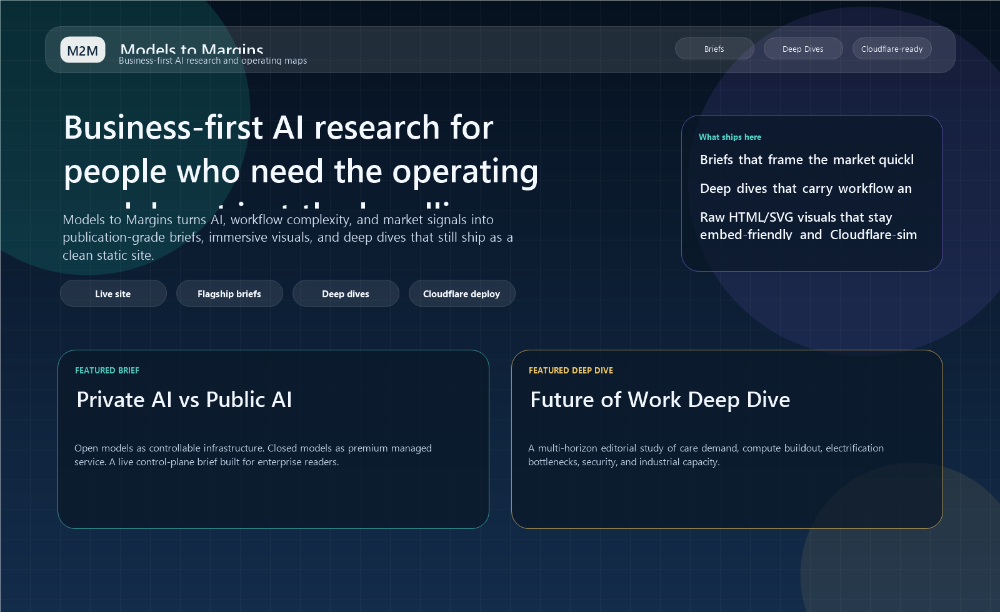
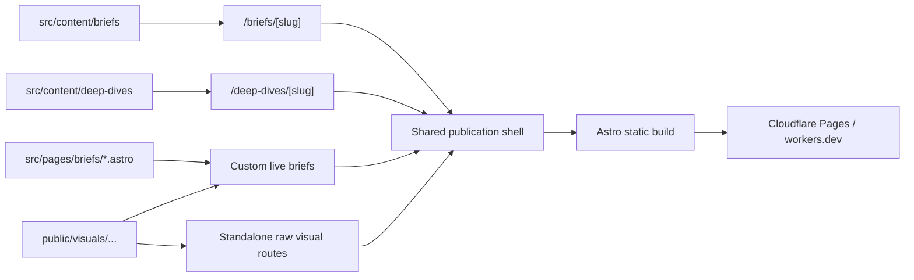

# Models to Margins

<div align="center">
  <p>
    <strong>Business-first AI research and operating maps.</strong>
  </p>
  <p>
    Models to Margins is a publication-style Astro site for turning AI, workflow complexity, and industry noise into
    flagship briefs, premium deep dives, and custom live briefs backed by raw HTML assets that still ship as a clean
    static deployment.
  </p>
  <p>
    <a href="https://models-to-margins.vinayagrw.workers.dev/"><strong>Live site</strong></a>
    &middot;
    <a href="https://models-to-margins.vinayagrw.workers.dev/briefs">Briefs</a>
    &middot;
    <a href="https://models-to-margins.vinayagrw.workers.dev/deep-dives">Deep Dives</a>
    &middot;
    <a href="./docs/cloudflare-pages-setup.md">Cloudflare guide</a>
    &middot;
    <a href="./docs/admin-visibility-how-to.md">Visibility guide</a>
  </p>
</div>

> [!NOTE]
> The current canonical public hostname is `https://models-to-margins.vinayagrw.workers.dev`. Keep app routes, iframe paths, back links, and raw asset references root-relative so the site works cleanly on that hostname and any future custom domain.

<p align="center">
  
</p>

> [!IMPORTANT]
> This repo is not a generic content site. It is an opinionated publishing system for AI analysis that prioritizes operating clarity, visual explanation, and static-first delivery.

## What This Is

| Surface | What it does | Why it matters |
|---|---|---|
| Editorial briefs | Publishes concise, high-signal analysis on companies, architectures, and workflow shifts. | Gives readers the fast front door into the topic. |
| Custom live briefs | Publishes immersive brief routes under `/briefs/*` when the story needs an embedded operating map or command-center experience. | Keeps the public information architecture centered on Briefs instead of splitting discovery into a separate visual collection. |
| Premium deep dives | Turns long-form research into structured editorial experiences using modern Markdown and semantic HTML. | Makes dense analysis readable without flattening the detail. |
| Raw visual assets | Hosts handcrafted HTML and SVG pages under `public/visuals/...`. | Keeps immersive experiences fast, portable, and easy to embed in live briefs or deep dives. |
| Static Astro delivery | Combines content collections, shared shell components, and clean routes into a static output. | Keeps deploys simple on Cloudflare while preserving a premium reading experience. |

## What Makes It Different

- **Business-first framing**: the site is built to explain operating consequences, not just announce AI news.
- **Live brief architecture**: immersive experiences stay inside the Brief collection instead of becoming disconnected microsites.
- **Raw assets stay portable**: custom HTML visuals remain framework-independent and embed-friendly.
- **Structured long-form writing**: deep dives use signal cards, reading maps, callouts, decision grids, and collapsible sections rather than plain wall-of-text documents.
- **Cloudflare-ready by default**: the entire output stays static, which keeps build and deployment mechanics easy to reason about.

## What's Live

| Experience | Route | Format | What it demonstrates |
|---|---|---|---|
| Private AI vs Public AI | `/briefs/private-ai-vs-public-ai` | custom live brief | Shared shell + live visual + decision framing in one page |
| Governed Procurement AI | `/briefs/governed-procurement-ai` | custom live brief | Procurement command-center brief with governed execution and ROI framing |
| AI for Corporate Clarity | `/briefs/ai-for-corporate-clarity` | custom live brief | Clarity board + stakeholder translation workflow for executive communication |
| Future of Work Deep Dive | `/deep-dives/future-of-work-2026` | premium deep dive | Modern Markdown, semantic HTML, structured editorial design |

## How It Works



> [!NOTE]
> The core architectural choice in this repo is deliberate: content collections handle editorial work, while `public/visuals/...` keeps immersive experiences as raw assets so they stay portable and embed-friendly inside custom live briefs.

## Content And Route Model

### Public surfaces

| Surface | Primary route | Source of truth |
|---|---|---|
| Home | `/` | `src/pages/index.astro` |
| Briefs index | `/briefs` | `src/pages/briefs/index.astro` |
| Deep Dives index | `/deep-dives` | `src/pages/deep-dives/index.astro` |
| Custom live brief | `/briefs/private-ai-vs-public-ai` | `src/pages/briefs/private-ai-vs-public-ai.astro` |
| Custom live brief | `/briefs/governed-procurement-ai` | `src/pages/briefs/governed-procurement-ai.astro` |
| Custom live brief | `/briefs/ai-for-corporate-clarity` | `src/pages/briefs/ai-for-corporate-clarity.astro` |
| Premium deep dive | `/deep-dives/future-of-work-2026` | `src/content/deep-dives/future-of-work-2026.md` |

### Content model

| Collection / layer | Source directory | Primary renderer | Best use |
|---|---|---|---|
| Briefs | `src/content/briefs` | `src/pages/briefs/[slug].astro` | Flagship reads, company analysis, architecture framing |
| Deep Dives | `src/content/deep-dives` | `src/pages/deep-dives/[slug].astro` | Long-form research with stronger editorial structure |
| Custom live briefs | `src/pages/briefs/*.astro` | direct Astro routing | Immersive brief pages with embedded live assets and custom choreography |
| Raw visual assets | `public/visuals` | direct static routing | Internal HTML/SVG embed assets and optional standalone targets |

<details>
  <summary><strong>Repo map</strong></summary>

```text
models-to-margins/
  src/
    components/        Shared UI primitives
    content/           Typed editorial collections
    layouts/           Shared page shell
    pages/             Public routes and collection renderers
    styles/            Shared design system
  public/
    visuals/           Standalone HTML/SVG interactive experiences
  docs/
    cloudflare-pages-setup.md
    readme-assets/
  AGENTS.md            Repo-specific editing guardrails
```

</details>

## Authoring Workflow

### 1. Standard Brief

Use a Markdown file in `src/content/briefs/` when the page should render in the shared article shell.

Good fit:
- company snapshots
- architecture comparisons
- workflow or market framing

### 2. Custom live Brief

Use a dedicated Astro page in `src/pages/briefs/` when the page needs:

- an embedded live asset
- custom page choreography
- focus sync or iframe messaging
- an immersive command-center layout

Current references:
- `src/pages/briefs/private-ai-vs-public-ai.astro`
- `src/pages/briefs/governed-procurement-ai.astro`
- `src/pages/briefs/ai-for-corporate-clarity.astro`

### 3. Premium Deep Dive

Use `src/content/deep-dives/` with modern Markdown plus semantic HTML blocks when the material supports richer structure.

Preferred design vocabulary:
- note panel
- signal cards
- reading map
- callouts
- thesis / decision grids
- `details/summary` for longer ranked or source-heavy sections

Current reference:
- `src/content/deep-dives/future-of-work-2026.md`

### 4. Raw visual asset

Use `public/visuals/...` when the artifact should remain:

- pure static HTML/CSS/JS
- directly linkable
- easy to embed
- independent of framework runtime

> [!TIP]
> Before inventing a new pattern, check [`AGENTS.md`](./AGENTS.md). It captures the repo's current rules for page structure, metadata order, theme behavior, live-brief routing, raw visual chrome, and deep-dive presentation.

## Run Locally

```bash
npm install
npm run dev
```

Useful commands:

```bash
npm run build
npm run preview
npm run check
```

Visibility and discovery docs:

- [docs/admin-visibility-how-to.md](./docs/admin-visibility-how-to.md)

## Deploy

This repo is configured as a static Astro project.

| Setting | Value |
|---|---|
| Framework preset | `Astro` |
| Build command | `npm run build` |
| Output directory | `dist` |
| Root directory | leave empty unless the repo is nested inside a larger workspace |

Deployment docs:
- [docs/cloudflare-pages-setup.md](./docs/cloudflare-pages-setup.md)

## Repo Principles

- **Start from the business problem** before the technical stack.
- **Prefer shared shell components** over one-off page chrome.
- **Keep raw visuals first-class** as embed infrastructure instead of building a separate public visual collection by default.
- **Use modern Markdown and semantic HTML** before adding extra runtime dependencies.
- **Treat Cloudflare deployment simplicity as a feature**, not an afterthought.

<details>
  <summary><strong>Why this structure works</strong></summary>

- Astro content collections keep editorial content typed and easy to scale.
- Shared components keep metadata, navigation, and theme behavior consistent.
- Raw visual assets stay portable and easy to embed in higher-level pages.
- The publication can feel premium without becoming operationally fragile.

</details>
