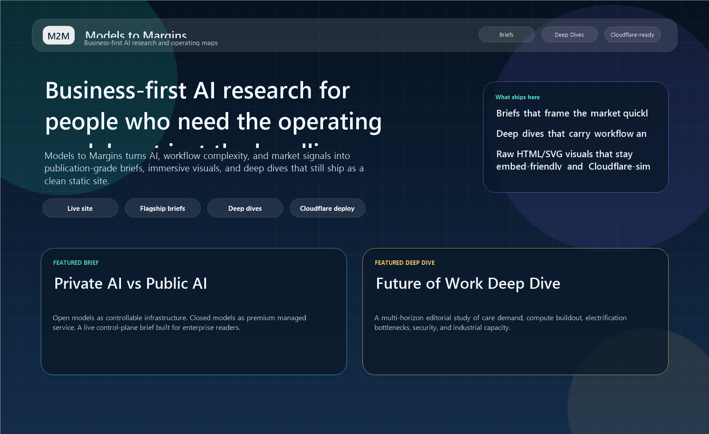
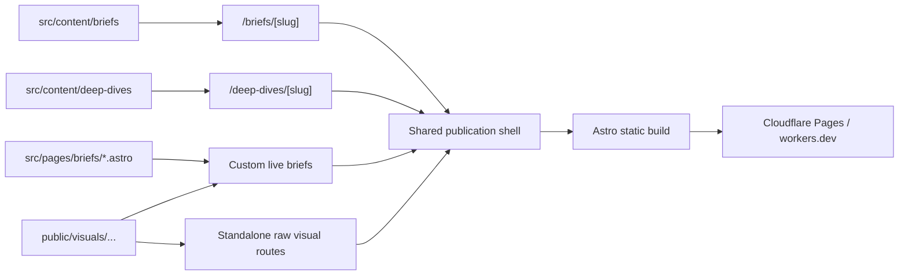

# Models to Margins

<div align="center">
  <p>
    <strong>Business-first AI research and operating maps.</strong>
  </p>
  <p>
    <a href="./LICENSE"></a>
    
    
    <a href="https://models-to-margins.vinayagrw.workers.dev/"></a>
  </p>
  <p>
    Models to Margins is a publication-style Astro site for turning AI, workflow complexity, and industry noise into
    flagship briefs, premium deep dives, and custom live briefs backed by raw HTML assets that still ship as a clean
    static deployment.
  </p>
  <p>
    <a href="https://models-to-margins.vinayagrw.workers.dev/"><strong>Live site</strong></a>
    &middot;
    <a href="https://models-to-margins.vinayagrw.workers.dev/briefs">Briefs</a>
    &middot;
    <a href="https://models-to-margins.vinayagrw.workers.dev/deep-dives">Deep Dives</a>
    &middot;
    <a href="./docs/brief-visual-prompt-pack.md">Brief visual prompt pack</a>
    &middot;
    <a href="./docs/cloudflare-pages-setup.md">Cloudflare guide</a>
    &middot;
    <a href="./docs/admin-visibility-how-to.md">Visibility guide</a>
  </p>
</div>

> [!NOTE]
> The current canonical public hostname is `https://models-to-margins.vinayagrw.workers.dev`. Keep app routes, iframe paths, back links, and raw asset references root-relative so the site works cleanly on that hostname and any future custom domain.

<p align="center">
  
</p>

> [!IMPORTANT]
> This repo is not a generic content site. It is an opinionated publishing system for AI analysis that prioritizes operating clarity, visual explanation, and static-first delivery.

## What This Is

| Surface | What it does | Why it matters |
|---|---|---|
| Editorial briefs | Publishes concise, high-signal analysis on companies, architectures, and workflow shifts. | Gives readers the fast front door into the topic. |
| Custom live briefs | Publishes immersive brief routes under `/briefs/*` when the story needs an embedded operating map or command-center experience. | Keeps the public information architecture centered on Briefs instead of splitting discovery into a separate visual collection. |
| Premium deep dives | Turns long-form research into structured editorial experiences using modern Markdown and semantic HTML. | Makes dense analysis readable without flattening the detail. |
| Raw visual assets | Hosts handcrafted HTML and SVG pages under `public/visuals/...`. | Keeps immersive experiences fast, portable, and easy to embed in live briefs or deep dives. |
| Static Astro delivery | Combines content collections, shared shell components, and clean routes into a static output. | Keeps deploys simple on Cloudflare while preserving a premium reading experience. |

## What Makes It Different

- **Business-first framing**: the site is built to explain operating consequences, not just announce AI news.
- **Live brief architecture**: immersive experiences stay inside the Brief collection instead of becoming disconnected microsites.
- **Raw assets stay portable**: custom HTML visuals remain framework-independent and embed-friendly.
- **Structured long-form writing**: deep dives use signal cards, reading maps, callouts, decision grids, and collapsible sections rather than plain wall-of-text documents.
- **Cloudflare-ready by default**: the entire output stays static, which keeps build and deployment mechanics easy to reason about.

## What's Live

| Experience | Route | Format | What it demonstrates |
|---|---|---|---|
| The Margin Reckoning — AI-Led SDLC | `/briefs/ai-led-sdlc` | custom live brief | Kinetic ledger weighing AI output volume against stalled margin across an 8-scene governed SDLC, with a river-flow review gate and cost-of-inaction heat matrix |
| Token Mission Control 2026 | `/briefs/token-optimization-2026` | custom live brief | Live atlas of token economics for agentic coding — context pruning, model routing, and budget controls that keep AI work from runaway spend |
| Where AI Margin Actually Accrues | `/briefs/operator-grade-intelligence-engine` | custom live brief | Scroll-editorial operating board on why durable AI value sticks to proprietary data, workflow queues, and execution rails over thin copilots |
| Private AI vs Public AI | `/briefs/private-ai-vs-public-ai` | custom live brief | Shared shell + live visual + decision framing in one page |
| Governed Procurement AI | `/briefs/governed-procurement-ai` | custom live brief | Procurement command-center brief with governed execution and ROI framing |
| AI for Corporate Clarity | `/briefs/ai-for-corporate-clarity` | custom live brief | Clarity board + stakeholder translation workflow for executive communication |
| AI Playbook for a 10-Year-Old | `/deep-dives/ai-playbook-for-explaining-a-problem-to-a-10-year-old` | premium deep dive | Research-backed playbook for using AI to translate hard ideas into child-sized explanations without becoming a shortcut machine |
| Future of Work Deep Dive | `/deep-dives/future-of-work-2026` | premium deep dive | Modern Markdown, semantic HTML, structured editorial design |
| Harness Engineering Deep Dive | `/deep-dives/harness-engineering` | premium deep dive + slide-deck sub-route | Article-shell page with 10 inline interactive visuals; optional `/present` sub-route renders the same content as a single-viewport keyboard-navigable slide deck |
| From Models to Margins — The Metric Chain | `/deep-dives/from-models-to-margins-metric-chain` | premium deep dive (bespoke Blueprint template) | Field-tested playbook on the five metric layers, four practices, and vanity traps for AI products, rendered in the bespoke `blueprint` template with 11 themed interactive visuals on a sticky scene spine |

## How It Works


```mermaid
flowchart LR
  A["src/content/briefs"] --> B["/briefs/[slug]"]
  C["src/content/deep-dives"] --> D["/deep-dives/[slug]"]
  E["src/pages/briefs/*.astro"] --> F["Custom live briefs"]
  G["public/visuals/..."] --> F
  G --> H["Standalone raw visual routes"]
  B --> I["Shared publication shell"]
  D --> I
  F --> I
  H --> I
  I --> J["Astro static build"]
  J --> K["Cloudflare Pages / workers.dev"]
```

> [!NOTE]
> The core architectural choice in this repo is deliberate: content collections handle editorial work, while `public/visuals/...` keeps immersive experiences as raw assets so they stay portable and embed-friendly inside custom live briefs.

## Content And Route Model

### Public surfaces

| Surface | Primary route | Source of truth |
|---|---|---|
| Home | `/` | `src/pages/index.astro` |
| Briefs index | `/briefs` | `src/pages/briefs/index.astro` |
| Deep Dives index | `/deep-dives` | `src/pages/deep-dives/index.astro` |
| Custom live brief | `/briefs/ai-led-sdlc` | `src/pages/briefs/ai-led-sdlc.astro` |
| Custom live brief | `/briefs/token-optimization-2026` | `src/pages/briefs/token-optimization-2026.astro` |
| Custom live brief | `/briefs/operator-grade-intelligence-engine` | `src/pages/briefs/operator-grade-intelligence-engine.astro` |
| Custom live brief | `/briefs/private-ai-vs-public-ai` | `src/pages/briefs/private-ai-vs-public-ai.astro` |
| Custom live brief | `/briefs/governed-procurement-ai` | `src/pages/briefs/governed-procurement-ai.astro` |
| Custom live brief | `/briefs/ai-for-corporate-clarity` | `src/pages/briefs/ai-for-corporate-clarity.astro` |
| Premium deep dive | `/deep-dives/ai-playbook-for-explaining-a-problem-to-a-10-year-old` | `src/content/deep-dives/ai-playbook-for-explaining-a-problem-to-a-10-year-old.md` |
| Premium deep dive | `/deep-dives/future-of-work-2026` | `src/content/deep-dives/future-of-work-2026.md` |
| Premium deep dive | `/deep-dives/harness-engineering` | `src/content/deep-dives/harness-engineering.md` (article-shell, canonical) |
| Slide-deck sub-route | `/deep-dives/harness-engineering/present` | `src/pages/deep-dives/harness-engineering/present.astro` (full-viewport slide deck of the same content) |
| Premium deep dive | `/deep-dives/from-models-to-margins-metric-chain` | `src/content/deep-dives/from-models-to-margins-metric-chain.md` (bespoke `template: blueprint`) |
| Hidden visitor analytics | `/admin/insights?key=…` | `src/pages/admin/insights.astro` + `public/scripts/insights*.js` (secret-gated, not linked from any public surface) |

### Content model

| Collection / layer | Source directory | Primary renderer | Best use |
|---|---|---|---|
| Briefs | `src/content/briefs` | `src/pages/briefs/[slug].astro` | Flagship reads, company analysis, architecture framing |
| Deep Dives | `src/content/deep-dives` | `src/pages/deep-dives/[slug].astro` | Long-form research with stronger editorial structure |
| Custom live briefs | `src/pages/briefs/*.astro` | direct Astro routing | Immersive brief pages with embedded live assets and custom choreography |
| Raw visual assets | `public/visuals` | direct static routing | Internal HTML/SVG embed assets and optional standalone targets |

<details>
  <summary><strong>Repo map</strong></summary>

```text
models-to-margins/
  src/
    components/        Shared UI primitives
    content/           Typed editorial collections
    integrations/      Astro dev middleware (analytics dev mirror)
    layouts/           Shared page shell
    pages/             Public routes, collection renderers, /admin
    styles/            Shared design system
  public/
    visuals/           Standalone HTML/SVG interactive experiences
    scripts/           Client beacon, dashboard, blueprint spine
    styles/            Bespoke deep-dive (blueprint) stylesheet
  functions/           Cloudflare Pages Functions (analytics collect/read)
  test/                Node test suite for enrichment + storage
  docs/
    cloudflare-pages-setup.md
    readme-assets/
  wrangler.toml        Cloudflare KV binding for analytics
  AGENTS.md            Repo-specific editing guardrails
```

</details>

## Authoring Workflow

### 1. Standard Brief

Use a Markdown file in `src/content/briefs/` when the page should render in the shared article shell.

Good fit:
- company snapshots
- architecture comparisons
- workflow or market framing

### 2. Custom live Brief

Use a dedicated Astro page in `src/pages/briefs/` when the page needs:

- an embedded live asset
- custom page choreography
- focus sync or iframe messaging
- an immersive command-center layout

Current references:
- `src/pages/briefs/ai-led-sdlc.astro` — iframes `the-margin-reckoning.html` with theme sync
- `src/pages/briefs/token-optimization-2026.astro`
- `src/pages/briefs/operator-grade-intelligence-engine.astro`
- `src/pages/briefs/private-ai-vs-public-ai.astro`
- `src/pages/briefs/governed-procurement-ai.astro`
- `src/pages/briefs/ai-for-corporate-clarity.astro`

### 3. Premium Deep Dive

Use `src/content/deep-dives/` with modern Markdown plus semantic HTML blocks when the material supports richer structure.

Preferred design vocabulary:
- note panel
- signal cards
- reading map
- callouts
- thesis / decision grids
- `details/summary` for longer ranked or source-heavy sections

Current references:
- `src/content/deep-dives/future-of-work-2026.md` — pure Markdown + small inline data-vis iframes
- `src/content/deep-dives/harness-engineering.md` — same article-shell, embedding a family of 10 large interactive visuals from `public/visuals/harness-engineering/`
- `src/content/deep-dives/from-models-to-margins-metric-chain.md` — bespoke `template: blueprint` shell with a sticky scene spine and 11 theme-synced visuals from `public/visuals/from-models-to-margins/`

#### Optional bespoke template

For a deep dive that needs its own visual identity, opt in with frontmatter `template: blueprint`. `src/pages/deep-dives/[slug].astro` then renders a `.dd-blueprint` shell and injects `public/styles/deep-dive-blueprint.css` + `public/scripts/spine-blueprint.js` instead of the default article shell. New bespoke looks add a `template:` value, a branch in `[slug].astro`, and scoped CSS/JS under a fresh `.dd-<name>` namespace. House-style note: prose in this template uses no semicolons or em-dashes (scene headings keep their em-dash because the reading-map anchors depend on the slug).

#### Optional slide-deck sub-route

When the same deep-dive content also benefits from a single-viewport "Present mode" (live talks, screen shares), add a sub-route at `src/pages/deep-dives/<slug>/present.astro`:

- The article-shell page at `/deep-dives/<slug>` stays canonical (matches site pattern, indexed normally).
- The sub-route at `/deep-dives/<slug>/present` re-uses the same visuals via iframes laid out as scroll-snap slides with keyboard navigation, side-dot indicators, and slim chrome.
- The article page links to the sub-route inside its `note-panel` block; the sub-route's back link returns to the article (not the deep-dives listing).
- Reference: `src/pages/deep-dives/harness-engineering/present.astro`.

### 4. Raw visual asset

Use `public/visuals/...` when the artifact should remain:

- pure static HTML/CSS/JS
- directly linkable
- easy to embed
- independent of framework runtime

> [!TIP]
> Before inventing a new pattern, check [`AGENTS.md`](./AGENTS.md). It captures the repo's current rules for page structure, metadata order, theme behavior, live-brief routing, raw visual chrome, and deep-dive presentation.

## Visitor Analytics (hidden)

A first-party, privacy-conscious analytics layer rides alongside the static site as Cloudflare Pages Functions. It is opt-out-friendly and never linked from any public surface.

| Piece | Path | Job |
|---|---|---|
| Client beacon | `public/scripts/beacon.js` | Collects pageview, device, geo-hint, and behavior signals; injected only on public pages |
| Collect endpoint | `functions/api/collect.js` | Enriches with Cloudflare geo/UA and writes events to KV (in-memory fallback) |
| Read endpoint | `functions/api/events.js` | Secret-gated event read; returns `404` when the token is absent or wrong |
| Dashboard | `src/pages/admin/insights.astro` | Hidden `/admin/insights` view: KPIs, world map, time series, breakdowns, filterable event table, CSV export |
| Storage | `functions/_shared/storage.js` | `KvStore` (primary) + `MemoryStore` (warn-and-degrade fallback) |

> [!IMPORTANT]
> The dashboard is gated by `env.INSIGHTS_TOKEN` and the KV binding is `env.ANALYTICS` (see `wrangler.toml`). Never hardcode the token or the binding values in source. Access the dashboard with `/admin/insights?key=YOUR_TOKEN`; the key is cached in a same-site cookie after first load.

## Run Locally

```bash
npm install
npm run dev
```

Useful commands:

```bash
npm run build
npm run preview
npm run check
npm test          # node --test: analytics enrichment + storage suites
```

Visibility and discovery docs:

- [docs/brief-visual-prompt-pack.md](./docs/brief-visual-prompt-pack.md)
- [docs/admin-visibility-how-to.md](./docs/admin-visibility-how-to.md)

## Deploy

This repo is configured as a static Astro project.

| Setting | Value |
|---|---|
| Framework preset | `Astro` |
| Build command | `npm run build` |
| Output directory | `dist` |
| Root directory | leave empty unless the repo is nested inside a larger workspace |

Deployment docs:
- [docs/cloudflare-pages-setup.md](./docs/cloudflare-pages-setup.md)

## Repo Principles

- **Start from the business problem** before the technical stack.
- **Prefer shared shell components** over one-off page chrome.
- **Keep raw visuals first-class** as embed infrastructure instead of building a separate public visual collection by default.
- **Use modern Markdown and semantic HTML** before adding extra runtime dependencies.
- **Treat Cloudflare deployment simplicity as a feature**, not an afterthought.

<details>
  <summary><strong>Why this structure works</strong></summary>

- Astro content collections keep editorial content typed and easy to scale.
- Shared components keep metadata, navigation, and theme behavior consistent.
- Raw visual assets stay portable and easy to embed in higher-level pages.
- The publication can feel premium without becoming operationally fragile.

</details>
