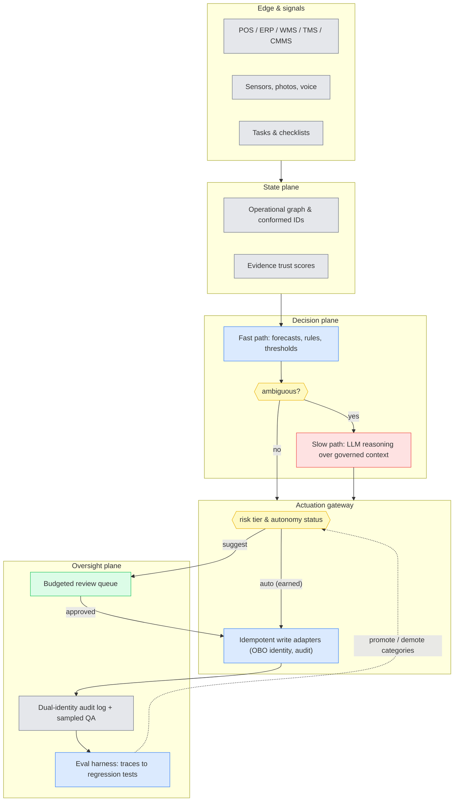
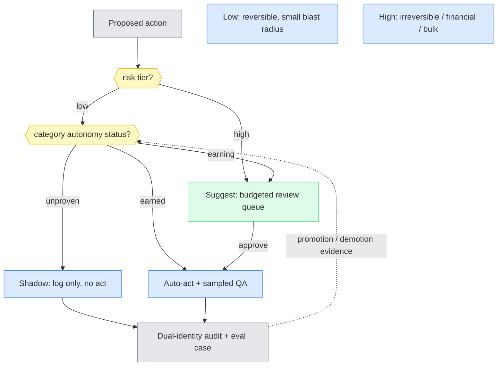
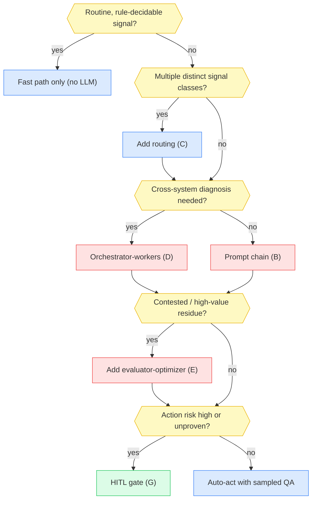

# AI Ops Execution Layer — Technical Design & Architecture

*A research-backed design for the layer that lets AI act — not just report — inside physical operations (restaurants, grocery, warehouse, transport, maintenance, procurement, claims). Upgrades the April 24, 2026 "AI-Ops Capability Atlas" from market brief to defensible architecture. Version 1.0, dated 2026-07-04. The SOTA window in §12 is 2026-05-01 → 2026-07-04.*

---

## 0. How to read this document

This document was reasoned through a panel of expert personas. Their stakes drive component decisions in §5–§8; when you see "Priya requires X," that is the rationale, not decoration.

| Persona | Role | Stake (what they refuse to compromise) |
|---|---|---|
| **Maya** | Solution architect | The system is composable; expensive compute goes only where ambiguity lives. |
| **Dev** | Ops-domain SME (multi-site retail/restaurant/logistics) | The hard frontline cases — noisy kitchens, pencil-whipped checklists, promo anomalies — are modeled, not flattened. |
| **Sam** | MLOps / evals lead | Nothing auto-acts without measured, per-action-category evidence; silent-failure rate is tracked, not just accuracy. |
| **Priya** | Security / identity lead | Agents never exceed the permissions of the human they act for; untrusted input is contained architecturally, not by classifier. |
| **Alex** | HITL / UX lead | The approval surface is a product, not a dumping ground; approval volume is capped before fatigue sets in. |

**Decided vs proposed vs open.** Facts from research are cited inline and graded in Appendix A. The architecture in §4–§8 is a **proposal**. Open questions are collected in §10 (critique) and §11 (what closed, what didn't).

**Reading paths.** Executives: §1, §3, §13. Architects: everything. Anyone about to put "99% forecast accuracy" in a deck: Appendix A first.

---

## 1. Requirements

### 1.1 Functional

The execution layer must, across seven operational domains (restaurant, grocery/retail, warehouse, transport, maintenance, procurement, claims):

- **F1 — Sense**: ingest operational signals (transactions, tasks, sensor/telemetry, images, voice, documents) from heterogeneous systems of record (POS, ERP, WMS, TMS, CMMS, case systems).
- **F2 — Decide**: turn signals into ranked exceptions and recommended actions (replenishment, task assignment, quote selection, escalation, dispatch) with per-action confidence evidence.
- **F3 — Act**: execute approved actions in the systems of record through a governed write path — idempotent, auditable, reversible where the target system permits.
- **F4 — Converse**: support frontline voice capture (counts, exceptions, closeouts) and manager-level natural-language analysis over governed metrics.
- **F5 — Verify**: check the physical world against standards via computer vision (photo/shelf/damage) without becoming an accusation machine.
- **F6 — Learn**: convert outcomes (approvals, overrides, corrections, failures) into eval cases and threshold updates.

### 1.2 Non-functional targets the evidence imposes

These are set from independent evidence, not vendor claims:

- **Consistency over peak capability.** τ-bench shows pass^1 ≈ 61% collapsing to pass^8 ≈ 25% on retail customer-service tasks — run the same task eight times and only a 1-in-4 chance of getting it right every time [S22]. TheAgentCompany's best 2025-checkpoint agent completed 30.3% of realistic multi-step enterprise tasks [S21]. Therefore: **auto-act is scoped per narrow action category, never per end-to-end task**, and every category needs its own measured track record.
- **Human-intervention budget.** 68% of production agents execute ≤10 steps before human intervention; 74% of teams use humans as the primary eval [S20]. The design assumes this is the operating point for 2026, not a transitional embarrassment.
- **Approval-volume ceiling.** Practitioner literature converges on rubber-stamping at roughly 30 approvals/person/day [S18]; healthcare CDS shows 90–95% override rates once alert volume outruns relevance [S12]. The oversight plane therefore has a hard budget, enforced by the system, not by hope.
- **Latency envelope.** Frontline voice interactions need sub-second confirmation loops (voice-picking precedent); exception routing is minutes; replenishment decisions are batch. The architecture must not force all three through one path.

### 1.3 Constraints

- **Brownfield always.** Every target estate already runs suites (Crunchtime/PAR-class, SAP/Oracle-class) that are shipping their own embedded agents. The layer must coexist with, not replace, suite-native AI.
- **Franchise/multi-entity reality.** Restaurants and grocery run franchisee-owned data under brand-level standards — tenancy is two-level (brand, operator) with asymmetric rights.
- **No greenfield identity.** Agent identity must compose with the customer's existing IdP; on-behalf-of semantics (RFC 8693 token exchange) rather than new service-account sprawl [S10].
- **Prompt-level instructions are not guardrails.** The Replit incident — an agent deleting a production database during an explicit, eleven-times-restated freeze — is the constraint stated as a story [S24]. Safety lives in infrastructure permissions, not system prompts.

---

## 2. The approach families the field uses

Five architectural families, from Strand A research. Confidence per family in Appendix A.

**Family 1 — Suite-native embedded AI.** AI woven into an operational suite that already owns state, identity, and write paths (Crunchtime's four April capabilities; PAR Intelligence; Samsara Agent Studio on its own telematics substrate). Wins on time-to-value inside the suite boundary; stops dead at it. Maturity: standard for forecasting, emerging for actuation.

**Family 2 — Overlay / control layer.** Owns no transactional system; builds a unifying representation above many, with governed write-back per target (Palantir AIP Ontology Actions; project44's agent portfolio on its logistics graph). Wins in fragmented estates; pays a per-target integration tax; the write-back adapter catalog is the moat. Maturity: emerging.

**Family 3 — Horizontal platform agents.** Agents on a workflow platform that owns tickets/cases/process state (ServiceNow AI Agent Orchestrator + Control Tower; Salesforce Agentforce). Wins where physical-ops work is already case-shaped (maintenance, claims, field service); weak at the physical edge. ServiceNow's own guidance — "start with read-only or propose-only actions" — is the graduation ladder in vendor print [S8]. Maturity: standard for IT-shaped work, emerging for physical ops.

**Family 4 — Vertical wedge.** One high-value decision loop owned end-to-end (Afresh's fresh-ordering engine, claimed 97% order adherence, vendor-reported; Avoca's $125M raise for trades voice agents). Wins on decision quality inside the wedge; expansion is a rebuild. Maturity: standard for ML-recommendation wedges, emerging for autonomous ones.

**Family 5 — DIY on agent frameworks.** LangGraph/OpenAI SDK/Claude agents + MCP as the tool bus; the enterprise owns the whole safety/eval/governance stack. Frameworks are mature; public evidence of DIY builds acting autonomously in physical operations is conspicuously thin — and MIT's Project NANDA found 95% of enterprise GenAI pilots delivered no measurable P&L impact [S9]. Maturity: experimental→emerging.

**Layering, not selection.** These families converge on the same four-plane anatomy — unified state, decision, governed actuation, oversight — and differ in who owns each plane. Real estates will run Family 1 inside each suite, with Family 2/3 machinery above them and Family 4 wedges where decision density justifies it. The design below is therefore a **reference architecture for the planes**, applicable whichever family owns them.

---

## 3. Recommended thesis (pre-critique)

**The execution layer is a governed write path with a graduated autonomy ladder — not a smarter brain.**

Concretely:

1. **Spend intelligence where ambiguity lives.** A cheap deterministic fast path (rules, forecasts, threshold checks) handles the routine majority of signals; LLM reasoning is reserved for the ambiguous residue (exception triage, cross-system diagnosis, document understanding). This is the fast-path/slow-path split.
2. **The write path is the product.** Every action flows through one actuation gateway that enforces identity (on-behalf-of), risk tiering, idempotency, audit, and blast-radius limits — regardless of which model or vendor proposed the action. The same three-rung graduation ladder appears independently in ServiceNow guidance, LangGraph practitioner patterns, and Afresh's human-executes model [S8, S7, S5]: **shadow → suggest → auto, per action category, with instant demotion.** We adopt it as the core product mechanic, not a rollout tactic.
3. **The oversight plane is budgeted.** Approvals are a scarce resource with a per-person daily cap; anything that would exceed the cap must either be demoted to shadow or earn auto-act status with evidence. This inverts the usual design: instead of "route uncertain things to humans," it is "humans have N decisions per day — make them count."

This thesis gets attacked in §10.

---

## 4. High-level architecture

*Legend: 🟦 control/orchestration · 🟩 human · 🟥 LLM reasoning · 🟨 decision gate · ⬛ data.*

**Walkthrough.** Signals land in the state plane, where identity resolution (store/item/vendor golden records) and evidence trust-scoring happen — a checklist completion carries its verification signals (duration, photo, sensor cross-check) as a trust weight, because pencil-whipping means completion records are claims, not facts [S15]. The decision plane runs the cheap fast path first; only ambiguous residue reaches LLM reasoning, which reads from governed context (semantic layer, not raw tables — the Spider 2.0 cliff shows frontier models dropping below ~25% on real enterprise schemas [S14]). Every proposed action, from either path, enters the actuation gateway, which knows two things about it: its **risk tier** (reversibility, financial impact, blast radius) and its **autonomy status** (shadow/suggest/auto, earned per category). The oversight plane closes the loop: budgeted approvals, dual-identity audit, sampled QA of auto-approved actions, and an eval harness that turns traces into regression tests and drives promotion/demotion.

**Trust boundary.** Everything arriving from the edge — documents, photos, voice transcripts, email — is untrusted *input data*, never instructions. The slow path runs with least-privilege tools and no direct exfiltration channel (the "lethal trifecta" rule: private data + untrusted content + exfiltration channel never coexist in one agent context) [S26].

---

## 5. Component deep-dive

### 5.1 State plane — the operational graph

Maya wants one queryable representation; Dev insists it model franchise reality (two-level tenancy, store-local assortments, promo calendars as first-class inputs). The load-bearing choice: **conformed dimensions before clever models.** Strand B evidence is blunt — NL-analyst and forecasting projects stall on store/item/vendor identity fragmentation, not on model quality [S14]. The graph also carries **evidence trust scores**: Dev's pencil-whipping signatures (2-minute completions of 15-minute checklists, temperature logs that never vary) become features that downweight suspect completions before anything acts on them [S15].

### 5.2 Fast path — the boring majority

Forecasting, replenishment suggestions, threshold-based exception detection, dedup/suppression. Sam's requirement: this path is deterministic and therefore fully regression-testable; it is also where alert stewardship lives — override rates monitored per alert type, low-value alerts retired on a schedule, the healthcare-CDS lesson applied to ops [S12].

### 5.3 Slow path — bounded reasoning

LLM work is bounded inside deterministic workflow steps (never a top-level autonomous controller): exception diagnosis across systems, document extraction for claims/procurement, voice-transcript interpretation. Priya's constraints shape it more than Maya's: quarantined context (untrusted documents parsed in a sandbox), tool allowlists per workflow, read-only by default. The CaMeL result — blocking injection by capability design rather than by classifier — is the direction of travel; detection-based defenses lost 81%-to-11% against adaptive attackers in NIST/CAISI red-teaming [S25, S26].

### 5.4 Actuation gateway — the product

One write path for all actors, human or model, with four enforcement duties:

- **Identity**: on-behalf-of token exchange (RFC 8693) so an agent architecturally cannot exceed the delegating human's rights; dual-identity audit records (initiating user → acting agent → resource → outcome) [S10].
- **Risk tiering**: every action class rated on reversibility, financial impact, blast radius (OpenAI's tool-risk rubric generalizes cleanly [S17]). Bulk operations ("apply to all stores") are always top-tier.
- **Idempotency & staging**: idempotency keys per action; where the target system of record supports no true rollback (most ERPs/WMS — reversal is a compensating document, not an undo), actions post through propose→approve→post staging [S10].
- **Autonomy status**: shadow/suggest/auto per action category; promotion requires shadow-mode precision above the human baseline with statistical confidence on that category; any metric drop demotes instantly [S19].

Alex's addition: a suggest-tier action ships with intent, reasoning summary, blast radius, and rollback plan — a reviewable package, not a bare "Approve?".

### 5.5 Frontline surfaces — voice and vision

Dev owns this section. Voice succeeds in physical ops as **closed-vocabulary command-and-confirm**, not open conversation — the 20-year voice-picking record (check-digit read-backs, noise-canceling hardware, on-device buffering) against the McDonald's/IBM drive-thru failure (accuracy plateaued ~80–85%, terminated 2024) is the cleanest natural experiment in the space [S13]. Vision follows asymmetric-cost design: detection-only uses (stockout gaps) tolerate lower precision; enforcement uses (compliance, theft) bias hard to precision and always keep a human between detection and accusation — Walmart/Everseen's false-positive revolt is the cautionary tale [S16]. Both surfaces feed the state plane, not the actuation gateway directly.

### 5.6 NL analyst — refusal as a feature

Managers query a governed semantic layer (defined metrics and dimensions, deterministic joins), never raw schemas. Out-of-model questions get a refusal plus a backlog entry, because a plausible wrong number that drives a reorder is the worst failure mode this surface has [S14].

### 5.7 Eval harness — traces to regression tests

Sam's plane. Deterministic action-level checks online (schema, policy invariants, state assertions); LLM-as-judge offline and sampled only. Trajectory evals are non-negotiable: 83% of perfect-outcome traces in one analysis still contained procedural violations [S23]. Every production failure becomes an eval case; OTel GenAI semantic conventions for tracing (still Development status at semconv v1.41 — emit now, expect churn) [S23].

---

## 6. Confidence, calibration & the human-in-the-loop

The part everyone hand-waves, so here it is without the wave:

- **Verbalized confidence is not a gate.** Models cluster stated confidence at 0.9–1.0 regardless of accuracy (ECE > 0.377 in measured settings); RLHF-trained models verbalize confidence *worse* than their own token probabilities [S27]. No credible production system found in research trusts "the model said 0.95" for auto-act.
- **What works**: self-consistency (k-sample agreement, semantic-entropy clustering) as the strongest black-box signal, at k× cost, applied only where a wrong action is expensive; composite gating signals in practice — retry count, tool-call count, cost, policy hits — with confidence as one input [S27, S20].
- **Thresholds are tuned, not derived.** Operating points come off a risk-coverage curve against a labeled review set, then recalibrated from the review loop. High-confidence auto-acted items are randomly sampled for human QA — the check on silent failure (confidently wrong), which is tracked as its own metric.
- **The review queue is budgeted.** Alex's cap: no reviewer sees more approvals per day than the rubber-stamping threshold (~30/day in practitioner literature; Anthropic's own usage data shows experienced users auto-approving in >40% of sessions — trust ratchets up whether or not accuracy justifies it [S18]). Excess demand doesn't queue; it demotes the noisiest category back to shadow. That pressure is the mechanism that forces alert stewardship to happen.

---

## 7. Data, multi-tenancy, security & governance

- **Tenancy**: two-level (brand, operator/franchisee) with asymmetric rights — brand sets standards and sees aggregates; operators own their transactional data. Agent permissions are scoped per tenant pair; cross-tenant learning (fleet-level models) only on contracted aggregates.
- **Identity & access**: agents are first-class non-human principals with their own credentials, acting via on-behalf-of exchange; tool-level authorization (RFC 9396-style rich authorization), not API-level; read-only defaults [S10]. The 2025 enterprise reality check: 92% of surveyed security leaders lack visibility into AI identities and only 16% govern their ERP-touching AI access effectively (vendor survey, directionally credible) [S11] — which is precisely why the gateway centralizes this rather than trusting per-team discipline.
- **Untrusted input**: documents, photos, transcripts, emails are data, never instructions. EchoLeak (CVE-2025-32711, zero-click exfiltration through M365 Copilot) and MCP tool-description poisoning (MCPTox) define the threat class; the lethal-trifecta rule and capability-based dataflow (CaMeL direction) are the architectural answers; injection classifiers are a supplementary, losing defense [S25, S26].
- **MCP posture**: adopt MCP as the tool bus (it is mainstreaming — ~41% of surveyed orgs at some production stage, and it now sits under the Linux Foundation), but treat its gaps as design work: identity, authN, and RBAC are undefined at protocol level per NSA guidance, so the gateway supplies them [S28].
- **Data flywheel governance**: outcomes data (approvals, overrides, corrections) is the layer's compounding asset; contracts must state whether fleet-level learning uses operator data, because the moat argument (§12) now rests on it.

---

## 8. Design patterns & comparison

Applying the agent-pattern catalog (A–G) to this domain:

- **A — Single-call**: an inner primitive (classify one photo, extract one field). Never an architecture.
- **B — Prompt chaining**: the slow-path backbone for document flows (parse → extract → validate → stage claim).
- **C — Routing**: the front door of the decision plane — signal class → specialist handler. Cheap, observable, essential at ops event volumes.
- **D — Orchestrator-workers**: cross-system exception diagnosis (orchestrator decomposes: check inventory, check carrier feed, check labor schedule — workers run in parallel). The core slow-path shape.
- **E — Evaluator-optimizer**: reserved for the expensive long tail (contested claims, high-value procurement comparisons) where a generate→verify loop earns its cost.
- **F — Autonomous ReAct**: bounded inner engine for genuinely exploratory sub-tasks (root-causing a data discrepancy), always inside a deterministic workflow step with a step budget — never the top-level controller. The τ-bench consistency collapse is the reason stated as a number [S22].
- **G — HITL checkpoint**: cross-cutting; implemented as the actuation gateway's suggest tier, budgeted per §6.

### Comparison matrix

| Dimension | B chain | C route | D orch-workers | E eval-opt | F ReAct | G HITL |
|---|---|---|---|---|---|---|
| Build complexity | 🟢 low | 🟢 low | 🟠 medium | 🟠 medium | 🔴 high | 🟠 medium |
| Latency | 🟢 bounded | 🟢 bounded | 🟠 parallel-bounded | 🔴 loop-bounded | 🔴 open-ended | 🔴 human-paced |
| Cost per item | 🟢 | 🟢 | 🟠 | 🔴 | 🔴 | 🟠 review labor |
| Easy ~80% of signals | 🟢 | 🟢 | 🟠 overkill | 🔴 overkill | 🔴 overkill | 🟠 overkill |
| Hard ~20% | 🟠 | 🔴 alone | 🟢 | 🟢 | 🟠 | 🟢 |
| Observability | 🟢 | 🟢 | 🟢 | 🟠 | 🔴 | 🟢 |
| Predictability | 🟢 | 🟢 | 🟢 | 🟠 | 🔴 | 🟢 |
| Best role | doc flows | front door | exception diagnosis | contested long tail | bounded exploration | risk gate |

### Which pattern when

**The composite** is §4's architecture: C at the front door, fast path for the routine majority, B/D/E layered in the slow path by residue difficulty, F only as a bounded inner engine, G as the gateway's suggest tier. The verdict the matrix forces: cheap deterministic patterns own the easy majority; reasoning patterns earn their cost only on the hard minority; and in *this* domain — where actions touch money and physical operations — G is not a pattern choice but the substrate everything else stands on.

### Anti-patterns observed in the wild

One giant "ops copilot" prompt; LLM-as-judge as the sole verifier of actions; an autonomous agent as top-level controller of live systems; verbalized confidence as the auto-act gate; blind overwrite of human corrections on re-run; alert systems with no stewardship function (the CDS failure, replayed).

---

## 9. Fit to the capability atlas

How the April brief's five anchor capabilities land on the planes:

| Atlas capability | Plane(s) | Pattern stack | Autonomy ceiling today |
|---|---|---|---|
| AI Forecasting | fast path | deterministic ML | auto (recommendations); ordering auto only via staged writes |
| Voice inventory | frontline surface → state | closed-vocabulary + read-back | auto for capture; suggest for adjustments |
| Photo intelligence | frontline surface → state | A inside C | auto for detection; human always in enforcement |
| AI Actions | decision + actuation | C → D → G | suggest; auto per category after shadow evidence |
| AI Analyst | NL analyst surface | B over semantic layer | auto for answers; suggest when it triggers actions |

The brief's "human approval required?" column becomes, in this design, a measured per-category autonomy status — the qualitative yes/usually/partial answers turn into promotion criteria.

---

## 10. Design critique — red-teaming our own approach

- **C1 — The gateway is a chokepoint nobody may buy.** Suite vendors (Family 1) ship their own actuation inside their own walls; a cross-cutting gateway only exists if the buyer forces it. If Crunchtime, SAP, and Blue Yonder each keep their own write paths, the "one governed write path" thesis fragments into per-suite governance — and the oversight plane becomes a dashboard over other people's ladders.
- **C2 — The autonomy ladder can rot into permanent suggest-mode.** Demotion is easy; promotion requires statistical evidence per category, which requires volume, which low-frequency categories (bulk repricing, high-value procurement) never accumulate. Result: the expensive review queue becomes the permanent operating mode for exactly the highest-value actions.
- **C3 — The approval budget may just relocate fatigue.** Capping approvals at ~30/day forces demotions, but shadow-mode actions still generate follow-up work (someone must do the task the agent didn't). The cap could turn alert fatigue into task-backlog fatigue one plane down.
- **C4 — Evidence trust-scoring can become surveillance.** Downweighting pencil-whipped checklists is analytically right and socially explosive — frontline workers being scored on "trust" by a machine is the Walmart/Everseen dynamic pointed inward at employees.
- **C5 — The consistency numbers may be stale.** τ-bench and TheAgentCompany figures are 2024–2025 checkpoints. If mid-2026 models have closed the pass^k gap, the design over-invests in gating; if not, vendors claiming "agentic autonomy" are selling past the evidence. Either way the design's central NFR rests on aging benchmarks.
- **C6 — Fleet-learning moat vs franchise data rights.** §7 assumes contracts settle whose data trains fleet models. In franchise systems this is a live legal fight, not a checkbox — the moat argument may be unenforceable exactly where the data is richest.
- **C7 — The semantic layer is a multi-year prerequisite dressed as a component.** §5.6 quietly requires conformed store/item/vendor masters across POS/ERP/WMS. That is an MDM program, historically measured in years and failures, sitting on the critical path of an "AI" project.
- **C8 — MCP standardization cuts against the overlay.** If MCP/A2A make every system of record cheaply addressable, the integration moat that justifies Family 2 economics erodes, and suites plus a thin orchestrator may beat a heavy overlay.

**What the critique changes.** C1 and C8 reframe the gateway from *product* to *capability that must attach to whatever write paths exist* (own gateway where possible, governance adapter over suite ladders where not). C2 adds a explicit design duty: low-volume/high-value categories get evaluator-optimizer treatment and *stay* human-approved by design, honestly labeled, rather than pretending they will graduate. C4 adds a worker-facing constraint: trust scores gate *data usage*, never individual performance management. C5 and C7 move to §11 as researchable; C3 and C6 remain open risks tracked in §13.

---

## 11. Concluding research — closing the gaps

- **C5 (stale benchmarks): partially closed.** No mid-2026 evidence found that the pass^k consistency gap has closed; newer models score higher on absolute pass^1 but follow-up work (arXiv 2603.29231) finds the reliability gap pattern persists. The gating investment stands. Remaining open: no τ-bench-class benchmark yet exists for physical-ops action domains specifically — the design's NFRs extrapolate from customer-service and office-task domains.
- **C7 (semantic-layer prerequisite): confirmed as the honest cost, with a mitigation.** The scope-and-expand pattern (model the ~50 metrics answering 80% of questions; instrument refusals as the expansion backlog) converts the MDM program from a prerequisite into an incremental track — but no evidence was found of an NL-analyst deployment succeeding *without* at least conformed store/item masters. The dependency is real; the design keeps the NL analyst out of wave 1 (§13.2).
- **C1/C8 (gateway positioning): the May–June evidence sharpened this rather than resolving it.** ServiceNow now explicitly positions itself as governor of every third-party agent; SAP's Autonomous Suite includes cross-vendor A2A interop. The governance chokepoint is becoming a platform battleground, which validates the *need* and threatens the *independent* version of it. §13 adopts the adapter posture.
- **C2 (promotion starvation): unresolved by evidence.** No published data found on autonomy-promotion rates per action category in production deployments. This is a genuine gap in the field's public knowledge — flagged as such rather than papered over.

---

## 12. What we missed — SOTA refresh (2026-05-01 → 2026-07-04)

Date-stamped deltas against the April 24 brief, each stated as what it changes:

1. **The thesis stopped being differentiating (May).** SAP's Autonomous Suite (50+ Joule assistants orchestrating 200+ agents, autonomous SCM), ServiceNow's Autonomous Workforce GAs, and Blue Yonder's cognitive agents made "reporting → execution" every mega-vendor's keynote. *Change: the brief's core claim is now consensus; positioning must move to the governed-write-path and evidence layers where differentiation still exists.*
2. **Actioning arrived on schedule — in ordering first.** Blue Yonder shipped agentic supplier-order approvals (May 25); Afresh landed Grocery Outlet for multi-category ordering (~June 15); Iceland moved invent.ai from category pilots to all-SKU replenishment (June). *Change: confirms the brief's "next wave is actioning" call, and locates the beachhead — staged, approvable ordering, exactly the gateway's suggest tier.*
3. **Crunchtime's early-access features did not GA in the window.** No AI Analyst / AI Actions / Photo Intelligence GA announcement May–June; PAR meanwhile reported ~1,700 live PAR Intelligence sites and a Burger King rollout at 400+ sites/month (vendor-stated, on an SEC-filed earnings call, May 7). *Change: the brief's Crunchtime-vs-PAR read inverts — PAR has the in-window production evidence.*
4. **Voice's second wave got funded while the first wave's obituary was written in the same article.** Arc's a16z seed (May 26) with live QSR deployments, against Fortune's catalog of the failed first wave (McDonald's/IBM terminated, Presto's SEC fraud charges, Taco Bell rethinking; ~21% of AI drive-thru orders still need human help). *Change: the brief's "promising" grade on voice holds, but the design doubles down on closed-vocabulary command-and-confirm as the survivable form.*
5. **The interop layer consolidated fast.** Copilot Studio's computer-using agents GA'd (May) — actuation without APIs for legacy ops systems; A2A hit 150+ member orgs with first production deployments (June); MCP reached ~41%-of-orgs production adoption in one survey. *Change: §7's MCP posture was written as a bet; it is now table stakes, and C8's moat erosion is running faster than the April brief assumed.*
6. **Industrial autonomy got a flagship.** Honeywell Experion Cognition announced autonomous control-room operations with Borouge (June), GA Q3 2026. Also: the brief's "Experion + Toshiba" claims-automation citation could not be re-verified this window and collides with the Honeywell Experion name — re-verify before reusing. *Change: one source-ledger correction, one new proof point for the control-layer family.*
7. **The skeptic column strengthened.** Gartner's agent-washing warning (~130 genuinely agentic vendors of thousands; >40% of agentic projects predicted canceled by end-2027) remains the anchor citation, joined in-window by pilot-stall coverage (June 30). *Change: §13's honest scope stays conservative; the design's evidence-before-autonomy stance is the defensible position in a market heading for a cancellation wave.*

---

## 13. Final recommendation & honest scope

### 13.1 The recommendation

Build (or buy toward) the four-plane reference architecture with the actuation gateway as the center of gravity: one governed write path enforcing on-behalf-of identity, risk tiers, idempotent staged writes, and a per-category shadow→suggest→auto ladder with a budgeted review queue and sampled QA. Spend LLM reasoning only on the ambiguous residue behind a routing front door. Where suite vendors own their own write paths, attach as the governance and evidence layer over their ladders rather than fighting for the write path itself.

### 13.2 Honest scope

- **Wave 1 (a quarter, one domain):** state-plane basics for one workflow (conformed IDs for its entities only), fast-path exception detection with stewardship metrics, actuation gateway in shadow+suggest for 2–3 action categories (staged ordering or task follow-up are the evidence-backed beachheads), review queue with the volume budget, dual-identity audit, traces-to-eval pipeline. **No auto-act in wave 1.**
- **Wave 2:** first auto-act promotions where shadow evidence clears the bar; voice capture (closed-vocabulary) if the workflow is count/closeout-shaped; CV detection (never enforcement) if photo flows exist.
- **Explicitly not bought by this scope:** the NL analyst (needs the semantic layer, §11), fleet-level learning (needs the data-rights contracts, C6), autonomous end-to-end task execution (needs benchmarks that don't exist yet, C5), and any promise containing the words "agentic OS."
- **Open risks carried forward:** C2 (promotion starvation on low-volume categories — design them as permanently human-approved), C3 (fatigue relocation — watch task-backlog metrics, not just approval metrics), C6 (franchise data rights — legal track, not engineering track).

---

## Appendix A — Source ledger

Grading: **High** = independent/primary + reproducible. **Med** = single credible source or trade press. **Low** = inference, contested, or vendor-only. Vendor self-reported numbers are excluded from headline claims throughout.

| # | Claim (short) | Source | Confidence | Notes |
|---|---|---|---|---|
| S1 | Crunchtime April capabilities; suite-native architecture | Crunchtime release + Restaurant Technology News (Apr 2026) | Med | "99% forecast accuracy" and "3–4x faster counts" are vendor-reported — excluded from claims |
| S2 | PAR Intelligence positioning; Q1 2026 revenue $124M, ARR $330M | PAR press release; earnings call transcript (May 7, 2026) | High (financials) / Low (site counts, Charter Foods +20%) | Site/rollout numbers vendor-stated on the call |
| S3 | Samsara Agent Studio on own telematics substrate | Samsara press release (June 2026) | Med | Data-scale figures vendor-reported |
| S4 | Palantir AIP ontology write-back; project44 agent portfolio | Palantir architecture docs; project44 release | High (architecture) / Low (p44 growth stats) | "60x interactions," "75% faster" excluded |
| S5 | Afresh decision engine; Grocery Outlet deployment (~Jun 15) | Afresh technical pages; Supply Chain Dive | High (deal) / Low (97% adherence, −25% shrink) | Impact figures vendor-reported |
| S6 | ServiceNow Orchestrator/Control Tower; Autonomous Workforce GAs | ServiceNow docs + newsroom (May 2026) | High | |
| S7 | LangGraph/MCP DIY patterns; MCP under Linux Foundation | LangChain changelog; DZone; LF announcements | Med-High | "400+ companies" vendor-reported |
| S8 | "Read-only → propose → auto-execute" vendor guidance | ServiceNow community implementation guide | Med | Vendor practitioner content, but against interest (counsels restraint) |
| S9 | 95% of enterprise GenAI pilots show no P&L impact | MIT Project NANDA via Fortune/Forbes (Aug 2025) | Med | Methodology debated; directionally corroborated by Gartner |
| S10 | OBO token exchange, tool-level scoping, dual-identity audit, staged writes | WorkOS; RFC 8693/9396; LoginRadius; practitioner patterns | High (standards) / Med (adoption) | |
| S11 | 92% lack AI-identity visibility; 16% govern effectively | Obsidian Security survey of 235 leaders (2025) | Low-Med | Vendor-published survey — directional only |
| S12 | CDS alert-fatigue: 90–95% override rates; tiering/suppression works | JAMIA systematic review; PMC CDS stewardship | High | Peer-reviewed; best fatigue evidence in any domain |
| S13 | McDonald's/IBM drive-thru terminated at ~80–85% accuracy; voice-picking succeeds via constrained vocabulary | Restaurant Dive; AI Incident DB #475; voice-picking industry docs | High (incident) / Low (vendor picking stats) | 99%+ picking accuracy is vendor-reported |
| S14 | Spider 2.0 cliff (<25% on real schemas); semantic layer as mitigation | Spider 2.0 benchmark; dbt/Omni analyses | High (benchmark) / Med (deployment accuracy claims) | "85–95% with semantic layer" is vendor-reported |
| S15 | Pencil-whipping phenomenon + detection signatures | ServiceChannel; SmartSense; Aubrey Daniels | Med-High | Practice well documented; prevalence unquantified |
| S16 | Walmart/Everseen false-positive failures | Wired via AI Incident DB #364 | High | Walmart disputed severity |
| S17 | Tool risk-rating rubric; escalation triggers | OpenAI "Practical Guide to Building Agents" (2025) | Med | Vendor guide, widely adopted |
| S18 | ~30 approvals/day rubber-stamp threshold; >40% session auto-approval among experienced users | MindStudio/TechTarget; arXiv 2606.24937 | Med / High | No controlled study of agent-approval fatigue exists — flagged gap |
| S19 | Shadow→suggest→auto rollout ladder, per-category promotion | ITSM Autopilot; Brightlume; convergent with S8 | Med | Pattern convergence across independent sources raises confidence |
| S20 | 68% of production agents ≤10 steps; 74% humans-as-primary-eval | arXiv 2512.04123 (306 practitioners, Dec 2025) | High | Best single production survey |
| S21 | TheAgentCompany: best agent 30.3% task completion | arXiv 2412.14161 (CMU, NeurIPS 2025) | High | 2025 checkpoints — see C5 |
| S22 | τ-bench pass^1 61% → pass^8 25% (retail) | arXiv 2406.12045; gap persistence arXiv 2603.29231 | High | The design's central NFR |
| S23 | Trajectory evals (83% perfect-reward traces had violations); OTel GenAI still Development status | Morph analysis; OTel semconv v1.41 | Med / High | |
| S24 | Replit agent deleted production DB during freeze | Fortune; AI Incident DB #1152 (Jul 2025) | High | |
| S25 | EchoLeak CVE-2025-32711; CamoLeak; MCPTox | CVE record; arXiv 2508.14925; security analyses | High | |
| S26 | 81% vs 11% hijack success (adaptive vs baseline); CaMeL capability defense | NIST CAISI red-team blog; arXiv 2503.18813 | High | |
| S27 | Verbalized confidence miscalibration (ECE >0.377); self-consistency strongest black-box signal | arXiv 2603.17839; TMLR honesty survey; adaptive SC papers | High | |
| S28 | MCP ~41% org adoption; A2A 150+ orgs; NSA on MCP identity gaps | Stacklok survey; Linux Foundation (Jun 2026); NSA guidance | Med-High | Exposed-instance counts (~200k) secondary — excluded |
| S29 | SAP Autonomous Suite; Copilot Studio CUA GA; Build 2026 | SAP News (May); Microsoft blogs (May–Jun 2026) | High | |
| S30 | Gartner: >40% agentic projects canceled by end-2027; ~130 real agentic vendors | Gartner press release (Jun 2025) | High | Out of SOTA window but unrefreshed anchor |
| S31 | R365 AI launch (May 12); Arc seed (May 26); Blue Yonder agents + agent-testing (May) | PRNewswire; Fortune; SiliconANGLE/Logistics Viewpoints | High (events) / Low (performance claims) | Arc's ">95% accuracy" vendor-reported |
| S32 | Honeywell Experion Cognition / Borouge (Jun); "Experion+Toshiba" needs re-verification | Honeywell release; April brief citation collision | High / flag | Name-collision risk both directions |
| S33 | April 24 brief content (capability table, extension map, patterns, opportunities) | ai-ops-capability-brief-2026-04-24.md | Med | First-party prior work; vendor claims within it re-graded here |
