# Metric & Evaluation Observability Platform for AI Products — Technical Design

> A research-backed solution design for the system *and* the operating practice that implement the five‑layer metric pyramid from **"The Metric Playbook for AI PMs: Five Layers, Four Practices, One Checklist."** It surveys how the field actually does this, reasons through it with a panel of expert personas, proposes an architecture, compares design patterns, red‑teams its own recommendation, and refreshes against the last two months of state of the art.

**Author:** Solution Design Explorer · **Date:** 2026‑06‑24 · **Audience:** technical / personal reference · **Mode:** AI‑system (LLM‑as‑judge, calibration, evals are load‑bearing)

**Source inspiration:** *The Metric Playbook for AI PMs* — five layers (Business → User Experience → Model Output → Model → System), four practices (name the trade; pre‑commit thresholds; map second‑order effects; treat dashboards as hypotheses), one checklist. Core thesis: *"Improving any single metric is almost never the work. The work is managing the trade‑offs between metrics — and maintaining the chain from the technical ones to the business ones."*

---

## 0. How to read this doc

This is a **hybrid** deliverable: it designs a *buildable platform* and the *PM operating practice* that rides on top of it. The two are inseparable here — the article's whole point is that the practice ("name the trade", "dashboards as hypotheses") fails without a system that can actually trace the chain, and a system without the practice just produces prettier vanity dashboards.

### Persona legend

The design is argued through six expert lenses. When a component exists "because Ravi requires X", that is the rationale, not decoration.

| Persona | Role | One‑line stake |
|---|---|---|
| **Maya Okonkwo** | Solution Architect | The chain must hold end‑to‑end, and it must be buildable on standard, vendor‑swappable infra. |
| **Dr. Ravi Menon** | MLOps / Evals Lead | Every number must be *trustworthy* — calibrated judges, drift gates, correct statistics, or it is noise. |
| **Lena Vasquez** | AI PM / Product‑Data SME | Metrics must map to *real user value* and *force* trade‑off decisions; vanity metrics get killed. |
| **Sofia Andersson** | Experimentation / Statistics Lead | Causal validity: pre‑registration, variance reduction, no peeking, surrogate metrics validated as *decision* tools. |
| **Tomás Bellaval** | Security / Governance / Privacy Lead | Traces carry PII and prompts; ownership, access, residency, and metric certification are non‑negotiable. |
| **Jon Park** | UX / Human‑in‑the‑Loop Lead | Confidence must gate human review; the system must distinguish user *surrender* from user *satisfaction*. |

### What is decided vs. open

- **Decided (thesis):** a four‑plane composite — a **trace spine** (OpenTelemetry GenAI) + an **eval harness** (offline + CI + canary + production sampling) + an **experimentation/OEC engine** (causal attribution & guardrails) + a **metric‑tree semantic overlay** (the lineage that ties layers together). No single existing tool covers the pyramid; the platform is a composition.
- **Open (flagged inline):** build‑vs‑buy of the trace spine; how aggressively to standardize on the still‑experimental OTel GenAI conventions; the exact surrogate‑validation cadence; whether to self‑host eval‑judge models. These are called out where they arise and revisited in §13.

> **Fact vs. proposal convention.** Plain statements with citations are *observed* from the research. Statements prefixed **[Proposed]** are this document's design choices, not established facts.

---

## 1. Requirements

### 1.1 Functional

| # | Requirement | Pyramid layer(s) |
|---|---|---|
| F1 | Capture every AI interaction as a structured trace: prompt, model/version, tokens (in/out/cached), latency, tool/agent steps, cost. | System, Model |
| F2 | Attach evaluation scores to traces — code assertions and LLM‑as‑judge — both offline (CI) and on sampled production traffic. | Model Output, Model |
| F3 | Record user‑side signals: acceptance, edit/correction, regeneration, abandonment, downstream task success. | User Experience |
| F4 | Maintain an explicit, versioned **metric tree** linking each lower‑layer metric to the higher‑layer metric it is *hypothesized* to drive. | All (the chain) |
| F5 | Run controlled experiments / canaries with a pre‑registered **OEC + guardrails**, and gate ship decisions on them. | Business, UX |
| F6 | Continuously re‑validate that the chain still holds (proxy↔outcome correlation is itself a monitored, decaying metric). | All |
| F7 | Confidence‑gate interactions into autonomous vs human‑review paths and feed the review back as labels. | Model Output, UX |
| F8 | Detect drift and regressions; auto‑rollback on guardrail breach. | Model, System |
| F9 | Surface "dashboards as hypotheses": every dashboard states the chain it assumes and flags when the chain breaks. | All |

### 1.2 Non‑functional

- **Trustworthiness first (Ravi/Sofia):** a metric that cannot be trusted is worse than no metric. SRM and data‑quality checks **block** before any metric is read.
- **Correct statistics by construction (Sofia):** the platform stores the *right statistical object* per metric (rate, percentile sketch, ratio, distribution) so dashboards *cannot* `avg(p99)` or average percentiles.
- **Low instrumentation tax (Maya):** one SDK call / auto‑instrumentation; ≤ a few % latency overhead; async export.
- **Vendor‑swappable (Maya):** standardize on open conventions (OTel GenAI) so the trace spine is not locked to one SaaS.
- **Privacy & residency (Tomás):** prompt/response payloads are PII‑bearing; redaction at source, scoped access, region pinning, retention tiers.
- **Latency of feedback (Lena):** System/Model metrics in seconds; UX in hours; Business in days–weeks. The platform must make the *latency mismatch* explicit, not hide it.

### 1.3 Constraints (assumed defaults — state and adjust)

- **[Proposed]** Build on a columnar store (ClickHouse‑class) for traces/scores; warehouse (semantic layer) for the metric tree; standard experimentation engine. No exotic infrastructure.
- **[Proposed]** Personal/learning context → favor open‑source, self‑hostable components and portable conventions over proprietary lock‑in.
- LLM‑as‑judge is permitted but **never trusted unvalidated** (see §7).

---

## 2. The five‑layer metric pyramid (the object we are instrumenting)

The article's pyramid is the spec. The platform's job is to instrument every layer *and* keep the arrows between them honest.

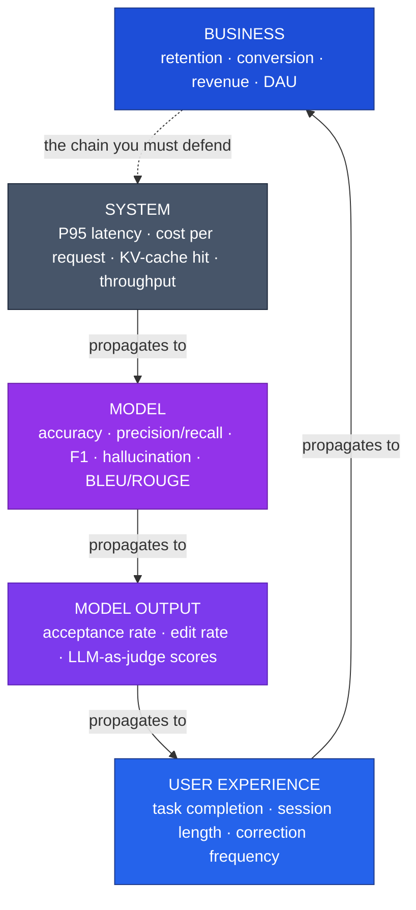

**The central difficulty, stated precisely (from Strand B):** the chain `System → Model → Output → UX → Business` is *multiplicative and leaky*. Each link can **attenuate** (a quality win that users never notice), **saturate** (latency already below the perception threshold), or **reverse** (the *surrogate paradox* — a proxy improves while the true outcome drops). The metric you can move fast and measure cheaply is never the one you actually care about, and the true outcome arrives weeks later. So you *must* substitute a surrogate and inherit the risk it is wrong. **This is the problem the platform exists to manage — not "track more metrics."**

---

## 3. How the field actually tackles this — the top approaches

From Strand A. Four genuinely distinct families; a fifth candidate ("product analytics extended to AI") is really Family A leaking into the analytics stack, not its own approach.

| Family | What it is | Representative tools | Wins when | Breaks when | Maturity (Jun 2026) |
|---|---|---|---|---|---|
| **A — LLM observability & tracing** | Per‑request spans (prompt, tokens, latency, cost, tool calls) + attached evals + dashboards | Langfuse, LangSmith, Arize Phoenix, Braintrust, Helicone/Portkey (gateways), W&B Weave, Datadog/New Relic LLM modules | You need runtime visibility & agent/RAG debugging | Pure *online* signal; no notion of the *business* tree; eval quality only as good as the graders wired in | High / consolidating |
| **B — Eval‑driven development** | Golden datasets + graders (code + LLM‑judge) run in CI as the correctness gate before ship | DeepEval, Braintrust, OpenAI Evals, promptfoo, TruLens, Evidently | You can specify correctness; want regression protection | Subjective tasks; judge drift/memorization; generic metrics give false confidence | Med‑High |
| **C — Metric‑tree / north‑star + drivers (+ semantic layer)** | Decompose a north‑star into driver/input metrics with explicit cause‑effect lineage, on a semantic layer | Metric trees (Mixpanel, Levers Labs), dbt/Cube semantic layers, Airbnb Minerva, Uber uMetric | You need to connect model signals to business outcomes & force trade‑offs | Not AI‑aware; lineage is *asserted*, not measured | High discipline / Med tooling / **Low for AI‑specific trees** |
| **D — Online experimentation + guardrails** | Controlled experiments with an **OEC** + guardrail metrics + statistical rigor (SRM, power, CUPED) | Statsig, Eppo, GrowthBook, LaunchDarkly; the Kohavi/Tang/Xu canon | You can route traffic & want *causal* attribution | LLM stochasticity inflates variance; subjective quality hard to instrument online; slow | High discipline / Med LLM adaptation |

**The synthesis that drives this design:** *no single family covers the pyramid.*

- **A** owns System + Model (the trace spine).
- **B** owns Model Output + Model (the eval gate).
- **D** owns Business + UX causal attribution (OEC + guardrails = the article's "name the trade" + "pre‑committed thresholds").
- **C** is the semantic overlay that *is* the metric chain (the article's "dashboards as hypotheses").

The article's four practices map cleanly onto D and C: *name the trade* → OEC; *pre‑committed thresholds* → guardrail metrics + eval pass/fail gates; *map second‑order effects* → guardrail + interaction analysis; *dashboards as hypotheses* → metric tree validated against production data.

**Two adversarial cautions carried forward:** (1) generic out‑of‑the‑box judge metrics ("hallucination", "helpfulness") are a documented trap — *"a false sense of security, leading teams to optimize for scores that don't actually correlate with user satisfaction"* (Pragmatic Engineer); (2) the OTel GenAI conventions are **not yet stable** (agent/MCP spans still in *Development* as of May 2026) — design for dual‑emission, don't assume cross‑vendor portability.

---

## 4. Recommended approach — thesis (pre‑critique)

> **[Proposed] Build a four‑plane composite on a single production‑trace substrate.** Everything — system metrics, model metrics, eval scores, user signals, experiment readouts — hangs off the *same per‑interaction trace*. The metric tree is a semantic overlay on that substrate; experiments and guardrails are computed from it; confidence gating routes from it; drift and chain‑break alerts watch it.

The single most important architectural primitive, recurring across Strands B, C and D, is the **corpus / holdout pattern**: *a periodically‑refreshed ground‑truth anchor against which a cheap proxy is continuously re‑validated.* It appears three times under three names and they are the same idea:

- Microsoft ExP's **labeled corpus of past experiments** (validate that a metric is directional & sensitive).
- The LLM‑judge's **human‑labeled holdout** (validate the judge against humans before trusting it).
- The **production‑sampled eval set** (validate that offline accuracy still mirrors production).

**[Proposed] Make that primitive a first‑class platform service** — a "Ground‑Truth Anchor" store that every proxy (judge, surrogate metric, drift detector) is continuously scored against. This is the design's load‑bearing idea.

The validation standard throughout is **decision‑agreement, not point‑estimate correlation** (Netflix surrogate‑index framing): the question is never "does the proxy correlate with the outcome?" but "does the proxy yield the same *ship / no‑ship call* as the oracle?", reported as recall / FPR / regret.

---

## 5. High‑level architecture

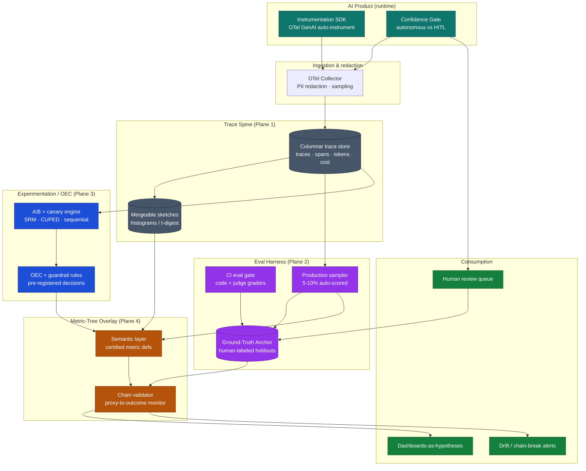

**Reading the architecture through the personas:**

- **Maya (architect):** the four planes are independently swappable because they communicate through the trace substrate and the semantic layer — not through point‑to‑point coupling. The trace spine is OTel‑GenAI‑native so the SaaS underneath it (Langfuse, Phoenix, a cloud APM) can be replaced.
- **Tomás (security):** redaction happens in the Collector *before* storage — payloads never land unredacted. The Ground‑Truth Anchor (which holds human‑reviewed, possibly sensitive content) is the most tightly access‑controlled store.
- **Sofia (stats):** the **mergeable sketches** node is not a detail — it is *why* the platform can report a correct global P95 across nodes and time windows. Percentiles are never averaged; distributions are merged then read.
- **Ravi (evals):** the **Ground‑Truth Anchor** sits at the convergence of three arrows (CI graders, production sampler, HITL queue). That is deliberate: it is the one place where machine proxies meet human truth.
- **Lena (PM):** the **Chain validator** is what turns a wall of dashboards into "dashboards as hypotheses" — it watches whether each asserted arrow in the metric tree still holds.

---

## 6. Component deep‑dive (with persona rationale)

### 6.1 Trace spine — System & Model layers (Plane 1)

**What it stores.** One trace per user interaction; spans for each LLM call, tool/agent step, retrieval. Per the **OTel GenAI semantic conventions**: `gen_ai.usage.input_tokens` / `output_tokens`, and crucially the cache attributes `gen_ai.usage.cache_read.input_tokens` / `cache_creation.input_tokens` — which let the System layer compute cost *correctly* (cached reads at ~0.1× input price; cache writes at 1.25–2× — so a cache that is written but rarely re‑read is net‑negative).

**Sofia's non‑negotiable — store the right statistical object:**

| Metric type | Statistical object | Aggregation rule | CI method |
|---|---|---|---|
| Latency (P95, P99) | order statistic | **mergeable histogram / t‑digest** — never average percentiles | bootstrap (BCa for tails) |
| Acceptance / hallucination rate | binomial proportion | pool raw counts (Σnum/Σden), never average per‑bucket rates | **Wilson score** interval |
| Cost per successful task | ratio of means (clusters by user) | **delta method** variance (propagates num, den, *and* covariance) | delta method |
| Score distributions | distribution | the only losslessly aggregatable object — keep the histogram | — |

> **The single most common observability error this design forbids:** `avg(p99)`. *"The median of two medians is not the median of the combined set."* The platform exposes only merge‑then‑read percentiles. It also defends against **coordinated omission** (a stalled system stops sampling during the stall, hiding the worst latency) by measuring service + queue time under constant‑rate load.

**Cost done right (Strand D6).** The honest unit is **cost per *successfully completed* task**, not per request or token — failed/retried calls burn tokens and produce no value. A cheaper model that fails more can cost *more* per resolved task. The spine therefore tracks tokens‑per‑task summed across all turns/tool calls, separating input/output (output is ~3–5× pricier) and cached/uncached, and rolls up to **contribution margin per task** — the bridge from System layer to Business layer. *(All provider prices are point‑in‑time as of 2026‑06‑24; re‑verify.)*

### 6.2 Eval harness — Model Output & Model layers (Plane 2)

**Structure (eval‑driven development).** An eval = dataset (golden set) + grader + harness. Two grader types: **code assertions** (cheap, deterministic, every commit) and **LLM‑as‑judge** (subjective calls only, and only when validated — see §7). Layered as **L1 → L2 → L3**:

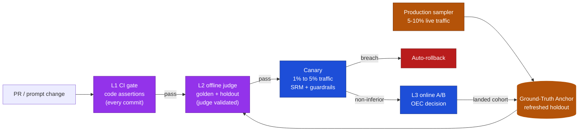

**Ravi's discipline:** prefer **binary PASS/FAIL** over 1–5 Likert (the difference between a "3" and a "4" is subjective and inconsistent). Generic pre‑built metrics are banned until validated against this product's data — they are the documented trap. Golden cases are minted *from production failures* (error analysis: build a trace viewer, categorize real failure modes, write one eval per mode).

**Bridging the online/offline gap (Strand B6).** Offline accuracy is necessary, not sufficient — production has a shifting input distribution, counterfactual outcomes the logs never observed, and degenerate feedback loops. The harness therefore (a) continuously refreshes the eval set from sampled production traffic, (b) runs **shadow/replay evals** (the strongest recent signal — see §12), and (c) treats "which offline metric predicts online lift" as an *empirical* question per product, not an assumption.

### 6.3 Experimentation / OEC engine — Business & UX layers (Plane 3)

This plane *is* the article's "name the trade" and "pre‑committed thresholds", made statistically real.

- **OEC (name the trade):** a single quantitative criterion, weights fixed *ex‑ante* and test‑independent (Bing forbids per‑experiment weight tuning — it is a cherry‑picking knob). `OEC = Σ wᵢ · normalizeᵢ(metricᵢ)`.
- **Guardrails (pre‑committed thresholds):** evaluated by **non‑inferiority / equivalence** testing, not superiority. "Ship a cheaper model only if quality is no worse by margin *m*." Absence of a significant difference is **not** evidence of equivalence. SRM is *"the most important guardrail every experiment should have."*
- **Variance is the enemy (Sofia, Strand D1):** LLM metrics have high σ², so naive A/B tests are routinely 1–2 orders of magnitude underpowered. Levers: **CUPED** (variance ↓ ≈ ρ²; ρ≈0.5 → ~25% fewer users), **interleaving** for ranker comparisons (Netflix >100× fewer users; but it is a *screen*, not a confirmatory test), **sequential / always‑valid p‑values** for peeking‑safe guardrail monitoring.
- **The β‑correction nobody applies:** stacking guardrails needs a *power* correction (β* = β/(G+1)), or "5 guardrails can drop simultaneous power below 40%" and you can't ship anything. Success metrics split α; guardrails split β.

**Pre‑registered decision rule (Spotify pattern):** *Ship iff* superior on ≥1 success metric **and** non‑inferior on **all** guardrails **and** no deterioration **and** no trust violation (SRM passes). This decision table lives in the design doc *before* unblinding.

### 6.4 Metric‑tree overlay & chain validator — the whole chain (Plane 4)

The semantic layer holds **certified metric definitions** (one definition, computed once, used everywhere — the Airbnb Minerva / Uber uMetric pattern that kills "the same metric computed three different ways"). On top sits the **chain validator**, the component that makes dashboards honest.

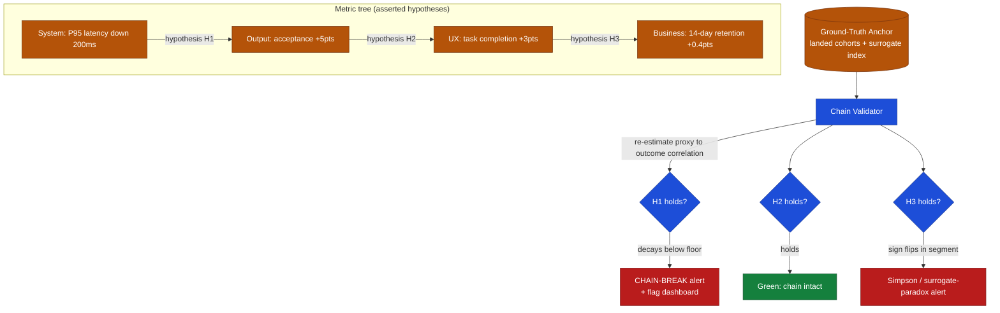

**How "dashboards as hypotheses" becomes real:** each edge in the tree is a stored hypothesis with a *measured* proxy↔outcome correlation. The validator periodically re‑estimates that correlation on landed cohorts (surrogate‑index logic) and **alerts when it decays below a floor** or **flips sign in a key segment** (Simpson's paradox / surrogate paradox). The dashboard literally renders the assumed chain and colors the broken link red. This directly answers the article's *"After shipping: trace broken chains when business metrics don't move."*

**Surrogate validation (Strand B1):** a 14‑day surrogate index can agree with the 63‑day outcome ~95% of the time *as a decision tool* (Netflix), but recall drops on borderline effects — so the platform reports **decision agreement (recall/FPR/regret)**, keeps a **long‑horizon holdout** to catch comparability drift, and tracks **segment fragility** (the fraction of segments where the proxy's sign disagrees with the global outcome — operationalized Goodhart/Simpson detection; recommender proxies can be ~68% fragile).

---

## 7. Confidence, calibration & HITL — the part everyone hand‑waves

This is where AI products silently fail, and where the article's "acceptance rate masking user surrender" lives. Two distinct trust problems: **is the model's confidence real?** and **is the judge's score real?**

### 7.1 Model confidence as a gated decision signal

A confidence score is useful only if **calibrated**: among predictions made at confidence *p*, a fraction *p* should be correct. RLHF'd LLMs are systematically **overconfident**, so raw softmax/verbalized confidence cannot be trusted for routing or SLAs.

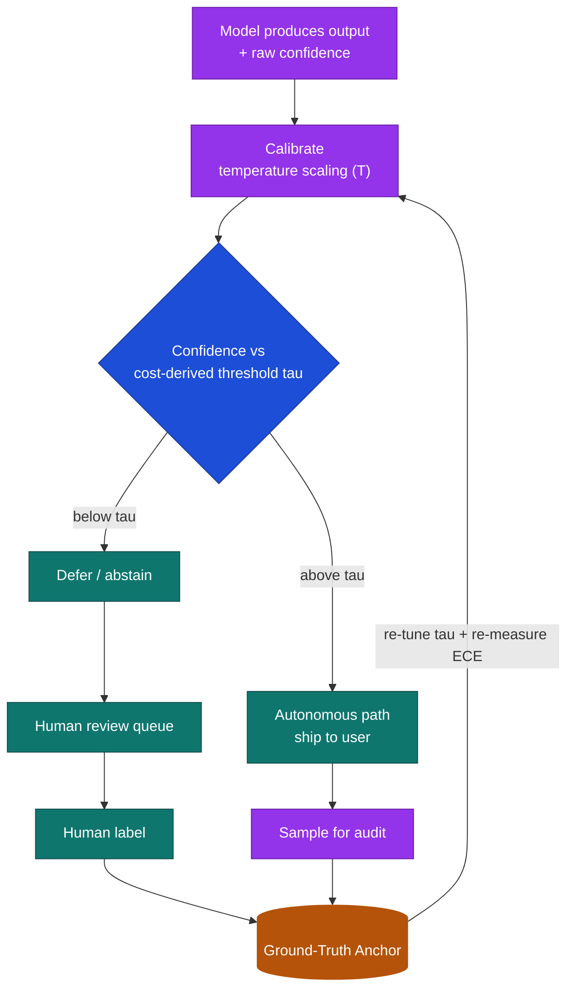

- **Measure:** ECE (binned |accuracy − confidence|), MCE (worst bin, for high‑stakes), reliability diagram (bars below diagonal = overconfident), Brier/NLL (proper scoring — calibration *and* sharpness).
- **Fix:** temperature scaling (divide logits by learned scalar T; accuracy‑preserving) is the strong simple baseline.
- **Gate:** the HITL threshold τ is **derived from the risk‑coverage curve × your cost ratio** — `cost(autonomous error)·P(error|answer)` vs `cost(human review)` — **not** a magic 0.9. Re‑tune as the model drifts.
- **Caveat (Jon/Ravi):** conformal prediction gives distribution‑free coverage but only *marginal* (not per‑instance) and **breaks under distribution shift**; verbalized confidence can beat log‑probs for RLHF models or vice‑versa — *measure both, trust neither by default.* Re‑measure ECE per model release; published numbers age fast.

### 7.2 LLM‑as‑judge calibration (the Model‑Output trap)

An LLM judge is a measurement instrument built from the same flawed material it measures. It can agree with *itself* across runs while disagreeing with *humans* — **high reliability, low validity.**

- **Known biases:** position bias (GPT‑3.5 ~50% flip rate under answer‑order swap), verbosity bias (longer answer preferred >90% with no quality gain), **self‑preference** (a model favors its own family's outputs). Mitigate: swap positions and count a win only if order‑consistent; prefer **pairwise over pointwise**; critique‑then‑score; **panels of smaller diverse judges** (PoLL) beat a single large judge and cost ~7–8× less — but "nine judges, two effective votes": correlated errors mean *diversity*, not count, is what helps.
- **Human alignment is load‑bearing (Hamel Husain's critique shadowing):** one principal expert gives **binary pass/fail + written critique** on ~30 examples; iterate the judge prompt to high agreement; measure with **precision/recall, not raw agreement**; >90% alignment is reachable in ~3 iterations. Validate against a human‑labeled holdout *before* trusting any judge dashboard.
- **Criteria drift (Shankar):** grading reveals the rubric, so a judge frozen at design time grades against a stale rubric. The judge gets *its own continuous eval* against the refreshed Ground‑Truth Anchor; track judge↔human κ over time and alarm on decay.
- **Agreement targets:** Cohen's κ (>0.8 almost perfect), Krippendorff's α (≥0.8 reliable); the ceiling is **human–human agreement**, not 100%.

### 7.3 Acceptance rate vs. user surrender (the UX‑layer trap)

Acceptance rate measures *input‑side engagement*, captured at the moment of **lowest** user information — before the cost of accepting is known. It cannot distinguish satisfaction from **satisficing/surrender** (accept "good enough", silently edit/revert) or **automation complacency** (accept without scrutiny under load). GitHub's own research: acceptance only weakly predicts felt productivity (ρ≈0.24).

**[Proposed] The platform never reports acceptance alone.** It triangulates:

| Signal | Reads | Surrender pattern |
|---|---|---|
| **Strong acceptance** (not deleted, <50% edited, critical tokens intact) | output‑side value | high accept + low strong‑accept |
| Post‑accept edit distance (normalized Levenshtein) | effort after accept | high accept + high edit |
| Persistence / survival (survives to final commit) | durable value | high accept + low survival |
| Regeneration / abandonment rate | dissatisfaction | high accept + high regen |
| Retention / DAU·WAU | the real outcome | high accept + flat retention |

**Decision rule:** *high acceptance + high edit + high regen + flat retention ⇒ surrender; high acceptance + low edit + high survival + rising retention ⇒ genuine value.* Acceptance is allowed only as an early adoption signal (months 1–3), then the team **graduates** to cycle‑time / downstream‑success / business outcome.

---

## 8. Data, multi‑tenancy, security & governance

**Tomás's plane.** Traces carry prompts and responses = PII and, in many products, regulated content.

- **Redaction at source:** the OTel Collector redacts before storage; payloads never land raw. Sensitive content in the Ground‑Truth Anchor (human‑reviewed) is the most tightly access‑scoped store, separate retention.
- **Residency & retention tiers:** region‑pinned storage; short TTL for raw payloads, longer for aggregated metrics and anchors.
- **Multi‑tenancy:** per‑tenant trace isolation; metric definitions are shared/certified but data is partitioned.
- **Governance (Strand D5) — metrics are governed assets, not ad‑hoc SQL:**
  - **Single source of truth:** the semantic layer (Minerva/uMetric pattern) so the same metric is *computed once*, used in dashboards, experiments, and ad‑hoc identically.
  - **Ownership & certification:** each layer of the pyramid has a named owner; high‑tier metrics (retention, revenue) get committee review, lower‑tier metrics get fast local authorization — **tiering** is how governance scales without becoming the bottleneck.
  - **Trust gates block reads:** SRM must pass (alarm at p < 0.0005; ~6% of Microsoft / ~10% of LinkedIn experiments fail it) *before* any metric is analyzed. Missing units aren't random (survivorship bias).
  - **North Star vs OMTM:** one stable North Star of core user value (not a vanity/revenue metric) + situational "one metric that matters" per stage; input metrics are the levers in the tree.

---

## 9. Design patterns & comparison

Several patterns can implement "metric observability for an AI product." Each has a place; the honest verdict is that **the right answer is a composition, not a single winner.**

### Pattern A — Trace‑spine only (pure observability)

Fast to stand up; covers System + some Model. **Blind to whether the business moved.** This is where most teams stop — and it is exactly the article's failure mode.

### Pattern B — Eval‑gate (CI‑for‑evals)

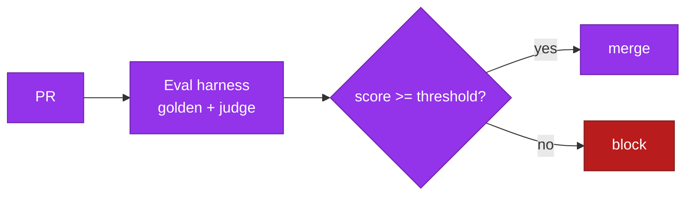
Strong regression protection pre‑ship. **Offline only** — says nothing about production distribution or business impact.

### Pattern C — Experiment‑first (OEC + guardrails)

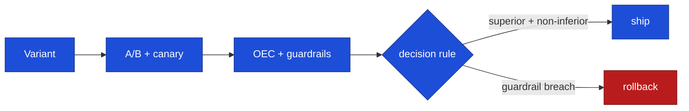
The only pattern giving *causal* business attribution. **Needs traffic + time; high variance for LLM features; subjective quality hard to instrument online.**

### Pattern D — Metric‑tree overlay (semantic lineage)

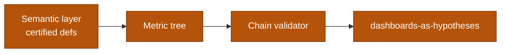
Makes the chain explicit and forces trade‑off conversations. **Not AI‑aware on its own; the lineage is asserted until something measures it.**

### Pattern E — Confidence‑gated HITL

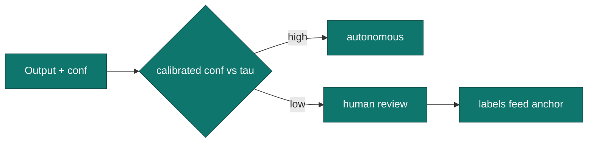
Turns confidence into safe automation + a label flywheel. **Useless if confidence is uncalibrated; needs human capacity.**

### Pattern F — Replay / shadow eval (production‑traffic replay)

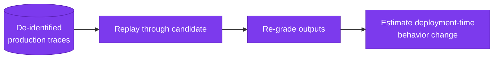
The freshest pattern (OpenAI Deployment Simulation, Jun 2026). Real‑distribution eval before ship. **No downstream feedback; needs a large stored trace corpus + a trusted grader.**

### Comparison matrix

| Dimension | A Trace‑spine | B Eval‑gate | C Experiment | D Metric‑tree | E Conf‑HITL | F Replay |
|---|---|---|---|---|---|---|
| Build complexity | Low | Med | High | Med | Med | Med‑High |
| Feedback latency | Seconds | Minutes (CI) | Days–weeks | Mixed | Seconds | Hours |
| Cost to run | Low | Low | Med | Low | Med (human) | Med (compute) |
| Easy‑80% coverage | System/Model | Output | Business/UX | Chain | Output safety | Model/Output |
| Hard‑20% (the chain, surrogates, surrender) | ✗ | ✗ | Partial | **✓ (if validated)** | Partial | Partial |
| Causal validity | ✗ | ✗ | **✓** | Asserted | ✗ | Estimated |
| Observability | **✓** | Partial | Partial | ✓ | Partial | Partial |
| Predictability / pre‑ship safety | ✗ | **✓** | ✗ (post‑hoc) | ✗ | ✓ | **✓** |
| Role in composite | substrate | pre‑ship gate | causal arbiter | lineage glue | safety + labels | pre‑ship realism |

### Which pattern when (decision tree)

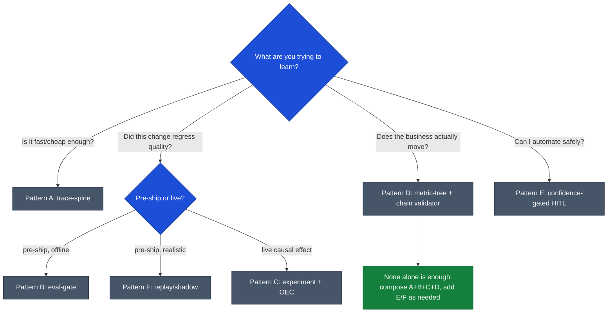

### Recommended composite

**[Proposed]** A (substrate) + B (pre‑ship gate) + C (causal arbiter) + D (lineage glue), with E and F layered where the product warrants (E for any product automating a user action; F once a trace corpus exists). The composite *is* §5. The verdict: each pattern owns a slice of the pyramid, and the **chain validator (D) + Ground‑Truth Anchor (shared by B, E, F)** are what stop the composite from being four disconnected tools.

---

## 10. Design critique — red‑teaming our own approach

The most valuable section: the critique a sharp reviewer would write anyway.

- **C1 — The single‑substrate bet is also a single point of failure / lock‑in.** Hanging everything off one trace store concentrates risk: an outage blinds all five layers at once, and "OTel‑native = swappable" is partly aspirational because the **agent/MCP conventions are still in *Development* (May 2026)**. *Mitigation:* dual‑emission, version‑pinning, and degrade‑gracefully (System/Model metrics must survive without the eval/experiment planes). **Residual risk: medium.**
- **C2 — The Ground‑Truth Anchor is a human‑labor bottleneck and itself a metric that can rot.** The whole design leans on a refreshed human‑labeled holdout, but human labeling is slow, expensive, and *its own quality drifts* (annotator disagreement, criteria drift). If the anchor lags production, every proxy validated against it is quietly stale. *Mitigation:* budget labeling explicitly, track inter‑annotator κ, and prioritize labeling by disagreement/uncertainty (active learning). **Residual: medium‑high — this is the design's load‑bearing wall.**
- **C3 — Chain validation may not have the statistical power to ever fire.** Re‑estimating proxy↔outcome correlation on landed cohorts needs large cohorts and long horizons; for low‑traffic products the validator may *never* reach significance, giving false comfort (a green chain that is merely underpowered). *Mitigation:* report power/CI on the validator itself; surface "insufficient data to confirm chain" as a distinct state from "chain holds." **Residual: medium.**
- **C4 — We may have over‑indexed on the experimentation canon for products that can't experiment.** Much of the rigor (OEC, CUPED, SRM, interleaving) assumes traffic and the ability to randomize. Many AI products (internal tools, low‑volume B2B, single‑tenant) can't run powered A/Bs. *Mitigation:* the composite degrades to A+B+F+D (replay + offline + asserted‑but‑monitored tree) when C is infeasible — but then causal claims weaken to *estimated*, and the doc must say so. **Residual: medium.**
- **C5 — LLM‑as‑judge is load‑bearing yet structurally circular.** Judges grade Output/Model layers, but judges are LLMs with self‑preference and drift; validating them needs humans, which routes back to C2. There is no escaping human ground truth somewhere. *Mitigation:* binary verdicts, panels for diversity, finetuned classifiers bootstrapped on internal labels (Yan's production‑grade form), continuous judge eval. **Residual: medium.**
- **C6 — Goodhart will attack every gate we install.** Every threshold (eval pass mark, acceptance, OEC, guardrail) becomes a target the org optimizes toward, including by gaming. The four Goodhart variants (regressional, extremal, causal, adversarial) each have a worked failure here (eval‑set overfitting, surrogate extremal failure, non‑causal proxy, reward hacking). *Mitigation:* pair every primary metric with a counter‑metric; rotate held‑out evals; treat the *chain‑break alert* as the Goodhart smoke detector. **Residual: high — this is inherent, not solvable, only managed.**
- **C7 — Cost/latency of the platform itself.** Auto‑instrumentation, 5–10% production auto‑scoring with judge LLMs, replay evals over 1M+ traces — the observability stack can rival the product's own inference bill. *Mitigation:* sample rather than score everything; use cheap code graders at L1; cache judge prompts; budget the eval spend as a line item. **Residual: medium.**
- **C8 — Latency elasticities and provider prices are borrowed and volatile.** The latency→revenue numbers (Amazon +100ms→−1%, Bing +100ms→$18M) are era/product‑specific; cache discounts and token prices shift monthly. Using them as constants would be wrong. *Mitigation:* the platform *measures its own* elasticity via deliberate slowdown experiments rather than importing constants. **Residual: low (if heeded).**

---

## 11. Concluding research — closing the gaps

Folding the critique back in (the research already surfaced most of the answers):

- **On C2/C5 (human‑truth bottleneck):** the strongest mitigation is **active‑learning prioritization** of labeling (label where the proxy is most uncertain or where judge↔human κ is decaying) plus **finetuned classifiers** bootstrapped on internally‑labeled data — the production‑grade form of an offline judge (Yan). This converts a continuous human cost into a periodic re‑calibration cost.
- **On C3 (validator power):** adopt the **surrogate‑index decision‑agreement** framing — don't ask for a significant correlation, ask whether the proxy yields the same ship/no‑ship call as the long‑horizon oracle on a holdout, reported as recall/FPR/regret. This is achievable at smaller cohort sizes than a full causal estimate and is the Netflix‑validated standard.
- **On C4 (can't‑experiment products):** the **replay/shadow** pattern (F) is the recent breakthrough that partially substitutes for live experimentation — OpenAI's Deployment Simulation hit 92% directional accuracy predicting deployment‑time behavior change from replayed traces. It is not causal on the *business* outcome, but it closes much of the pre‑ship gap without traffic.
- **On C6 (Goodhart):** there is no closing this gap, only instrumenting it. The **segment‑fragility metric** (fraction of segments where proxy sign disagrees with global outcome) is the most concrete operational Goodhart/Simpson detector found, and it becomes a first‑class chain‑validator output.

**What changes about the recommendation:** nothing structural, but the **Ground‑Truth Anchor is promoted from "a store" to the platform's most actively‑managed, owned, and budgeted asset** — with active‑learning label prioritization, an owner, a κ‑decay alarm, and an explicit refresh cadence. If only one thing is built well, it is this.

---

## 12. What we missed — last‑2‑months SOTA refresh (Apr–Jun 2026)

The user's explicit focus. Date‑stamped; confidence flagged. (Three frequently‑cited "AI PM eval" essays — Eugene Yan's *LLM‑as‑Judge Won't Save the Product*, Aman Khan's *Beyond vibe checks*, and the Hamel/Shreya FAQ — are **2025/Jan‑2026, NOT** the last two months; canonical, but don't mis‑date them.)

- **OpenAI "Deployment Simulation" (Jun 16, 2026) — HIGH.** Replay ~1.3M de‑identified past conversations through a *candidate* model, regrade, estimate deployment‑time bad‑behavior rates *before* shipping. 92% directional accuracy, ~1.5× median multiplicative error; caught novel failure modes ("calculator hacking"). **Implication:** validates Pattern F and the thesis that *evals belong on the production‑trace substrate.* This is the single most important recent signal for this design.
- **Langfuse Launch Week (May 25–29, 2026) — HIGH.** Concretely shipped exactly the primitives this design calls for: **Code Evaluators** (deterministic `evaluate()` in‑UI, no LLM cost), an **LLM‑as‑judge *calibration* skill** (auto accuracy/F1/precision/recall/cost for a judge — operationalizes §7.2), **Experiments in CI/CD** (PR tested against a dataset, fails on score drop — Pattern B as a release gate), and an **MCP server** (agents query their own eval telemetry). April adds: Evaluators API (eval‑as‑code), Experiments as a top‑level feature, boolean/text judge scores. *(ClickHouse acquired Langfuse, Jan 2026 — MEDIUM.)*
- **OTel GenAI semantic conventions — still *Development* (May 2026) — HIGH.** v1.37 was the inflection: per‑message events replaced by aggregated `gen_ai.input.messages` / `output.messages` / `system_instructions`; **cache token attributes standardized** (`cache_read` / `cache_creation`) — directly enabling correct System‑layer cost. Agent/workflow/tool spans defined but experimental. Datadog natively supports v1.37+. **Implication:** standardize now, **pin a version, expect churn, dual‑emit** — do *not* call it stable. *(This is the C1 risk, confirmed.)*
- **Trajectory / agent eval is the consensus frontier — MEDIUM.** Single‑pass output judges can't see the trajectory (wrong tool, needless loops, failure to recover). New metric classes: **TrajectoryAccuracy**, **ToolCorrectnessJudge**, **Agent‑as‑a‑Judge**. **Terminal‑Bench 2.0** (late Apr 2026): the *same model* swings 30–50 pts by harness. **Implication:** attribute every metric to **(model × harness × tool‑set × retry policy)**, not model alone — a concrete new requirement for the Model/System layers this design should adopt.
- **LangSmith cluster (Mar–Apr 2026) — MEDIUM (verify).** "Agent Builder" → **LangSmith Fleet**; **unified cost view across the full agent workflow**; **pin any experiment as baseline** for auto‑regression; scheduled Insights Agent; `LangSmith Fetch` CLI. *(April items unconfirmed on primary changelog — flagged.)*
- **Judge‑calibration norm consolidating — MEDIUM.** 2026 practitioner consensus: calibrate judges to ~85–90% agreement on a 100–200‑example human‑labeled reference set *before* trusting at scale — exactly what Langfuse's May calibration skill automates.

**The one‑line takeaway:** every strong Apr–Jun 2026 signal pushes the same architectural point this design already makes — **evals belong on the production‑trace substrate**, and **agent metrics must be trajectory‑aware and attributed to model × harness**, not single‑model final‑output scores. The recent additions to the design are: (1) adopt Pattern F (replay) explicitly, (2) add the **(model × harness)** attribution dimension, and (3) lean on shipped tooling (Langfuse code‑evaluators + judge‑calibration, OTel GenAI cache attributes) rather than building from scratch.

---

## 13. Final recommendation & honest scope

**Recommendation.** Build the **four‑plane composite on a production‑trace substrate** (§5), with the **Ground‑Truth Anchor + Chain Validator** as the two load‑bearing, must‑build‑well components. Standardize on **OTel GenAI conventions (version‑pinned, dual‑emitted)** for the spine; use shipped open tooling (Langfuse‑class) for eval/CI and judge calibration rather than reinventing; add **replay (Pattern F)** and **(model × harness)** attribution per the SOTA refresh. Operate it with the article's four practices made statistically real: **OEC** ("name the trade"), **non‑inferiority guardrails + β‑correction** ("pre‑committed thresholds"), **interaction/elasticity analysis** ("second‑order effects"), and the **chain validator** ("dashboards as hypotheses").

**Honest scope — what a realistic first build buys vs. the full vision:**

| Phase | What you get | What you do NOT yet get |
|---|---|---|
| **Phase 1 — Substrate + cost truth (Patterns A + correct stats)** | Trustworthy System/Model metrics: correct percentiles, cost‑per‑successful‑task, drift detection. The thing most teams *think* is the whole job. | Any link to the business; any eval. |
| **Phase 2 — Eval gate + judge calibration (Pattern B + §7.2)** | Pre‑ship regression protection; validated judges (not vanity scores); production‑sampled eval set. | Causal business attribution; online truth. |
| **Phase 3 — Metric tree + chain validator (Pattern D + §6.4)** | "Dashboards as hypotheses"; chain‑break and Simpson/surrogate‑paradox alerts; the article's core promise. | Powered causal proof (needs traffic). |
| **Phase 4 — Experiment/OEC + confidence‑gated HITL (C + E)** | Causal ship/no‑ship decisions; safe automation + label flywheel. | — (this is the full vision). |

**The honest caveat:** the chain validator and surrogate validation are only as good as the **Ground‑Truth Anchor**, which is a *standing human‑labeling commitment*, not a one‑time build. A team that funds the platform but not the labeling will get four pretty planes producing the very vanity metrics the article warns against. **Goodhart (C6) is never solved, only watched** — the platform's deepest job is detecting *when a measure has become a target*, and that is an operating discipline as much as a system.

---

## 14. Appendix — source ledger

Confidence: **H** high (independent/primary) · **M** medium (single/secondary/preprint) · **L** low (dating unconfirmed). Vendor self‑reported accuracy excluded throughout.

| # | Claim | Source | Conf. |
|---|---|---|---|
| 1 | No single tool family covers the pyramid; A/B/C/D are distinct | Firecrawl LLM‑observability comparison (2026‑06‑16); Pragmatic Engineer *Evals* | H |
| 2 | Generic out‑of‑box judge metrics create false confidence; prefer binary PASS/FAIL | Pragmatic Engineer, *A pragmatic guide to LLM evals* | H |
| 3 | OTel GenAI conventions still *Development* (agent/MCP); cache token attrs standardized; v1.37 aggregated messages | opentelemetry.io GenAI spans spec; OTel blog (2026‑05‑14); Greptime (2026‑05‑09); Datadog | H |
| 4 | Surrogate index: 14‑day ≈ 63‑day decision ~95%; validate as *decision* tool | Tran et al. arXiv:2311.11922 (Netflix); Athey et al. NBER w26463 | H |
| 5 | Prentice criteria; proportion explained; surrogate paradox | Prentice 1989; VanderWeele 2013 (PMC4221255) | H |
| 6 | Microsoft ExP metric validation: directionality + sensitivity on a labeled corpus (STEDII) | Dmitriev & Wu, CIKM 2016 | H |
| 7 | Segment fragility / proxy reliability; recommender proxies ~68% fragile | PROXIMA arXiv:2604.14352 (2026) | M |
| 8 | Goodhart four variants | Manheim & Garrabrant arXiv:1803.04585 | H |
| 9 | LLM‑judge biases: position/verbosity/self‑preference; pairwise > pointwise | Zheng et al. arXiv:2306.05685; Ye et al. arXiv:2410.02736; Panickssery et al. arXiv:2404.13076 | H |
| 10 | PoLL panels beat single judge, ~7–8× cheaper; but correlated errors ("nine judges, two votes") | Verga et al. arXiv:2404.18796; 2025/26 follow‑up | H / M |
| 11 | Critique shadowing: binary pass/fail, precision/recall, >90% in ~3 iters; criteria drift | Hamel Husain (hamel.dev); Shankar et al. arXiv:2404.12272 (EvalGen, UIST 2024) | H |
| 12 | Calibration: ECE/MCE/Brier; temperature scaling; RLHF degrades calibration | Guo et al. arXiv:1706.04599; Kadavath et al. arXiv:2207.05221 | H |
| 13 | Selective prediction: risk‑coverage, AURC; trained calibrator beats raw softmax under shift | Geifman & El‑Yaniv arXiv:1705.08500; Kamath et al. arXiv:2006.09462 | H |
| 14 | Verbalized confidence vs log‑probs; conformal marginal & breaks under shift | Xiong et al. arXiv:2306.13063; Tian et al. arXiv:2305.14975; Angelopoulos & Bates arXiv:2107.07511 | H |
| 15 | Acceptance weakly predicts felt productivity (ρ≈0.24) | Ziegler et al. arXiv:2205.06537 / CACM Mar 2024 | H |
| 16 | Strong acceptance, persistence/survival, churn; automation complacency | Ansible Lightspeed arXiv:2402.17442; GitClear 2025; Parasuraman & Manzey, Human Factors 2010 | H |
| 17 | Guardrails = non‑inferiority; SRM the most important guardrail (~6% MS / ~10% LinkedIn fail) | Kohavi/Tang/Xu 2020; Fabijan et al. KDD 2019; MS ExP SRM diagnosis | H |
| 18 | Latency elasticities (Amazon/Google/Bing/Booking); slowdown experiments; $18M/100ms | Kohavi "Speed Matters" / KDD 2014; James Hamilton 2009; Bernardi et al. KDD 2019 | H |
| 19 | Pre‑registered decision rule; OEC weights ex‑ante; β‑correction for stacked guardrails | Spotify arXiv:2402.11609; Kohavi/Tang/Xu 2020 | H |
| 20 | CUPED variance ≈ ρ²; interleaving >100× (Netflix) / ~4% traffic (Airbnb) | Deng et al. 2013 (MS ExP); Netflix & Airbnb interleaving blogs | H |
| 21 | Sequential/always‑valid p‑values bound Type‑I under peeking | Johari et al., Operations Research 2021; Optimizely Stats Engine | H |
| 22 | Can't average percentiles; mergeable sketches (HdrHistogram/t‑digest); coordinated omission | Hartmann, ACM Queue; Gil Tene "How NOT to Measure Latency"; Dunning t‑digest | H |
| 23 | Wilson interval for rates; delta method for ratio metrics (intra‑user correlation) | Binomial CI (Wilson); Deng et al. KDD 2018 arXiv:1803.06336 | H |
| 24 | Drift: PSI bands, JS/MMD at scale, PSI blind to concept drift; ~80% "drift" is pipeline bugs | Chip Huyen (2022); Evidently docs; Lipton et al. arXiv:1802.03916 | H / M |
| 25 | Canary analysis (Kayenta): same‑window/same‑age comparison; guardrail breach forces rollback | Netflix Kayenta blog; Google Kayenta intro | H |
| 26 | Offline↔online gap: counterfactual/missing‑label, degenerate loops, OPE (IPS/SNIPS/DR) | Huyen; Gilotte et al. WSDM 2018 arXiv:1801.07030; Wilm & Normann arXiv:2507.09566 | H |
| 27 | Metrics as governed assets: Minerva/uMetric single source of truth; tiered review | Airbnb Minerva; Uber uMetric; Spotify/Netflix platforms | H |
| 28 | Cost per *successful* task; output ~3–5× input; cache discounts; goodput vs throughput | Anthropic prompt‑caching docs; DistServe OSDI'24 arXiv:2401.09670; tianpan.co (2026‑06‑02) | H / M (prices volatile) |
| 29 | OpenAI Deployment Simulation: replay 1.3M convs, 92% directional accuracy (Jun 16 2026) | openai.com/index/deployment-simulation; marktechpost (2026‑06‑16) | H |
| 30 | Langfuse Launch Week: code evaluators, judge‑calibration skill, CI/CD experiments (May 2026); April Evaluators API | langfuse.com monthly updates (Apr 30 / May 31 2026) | H |
| 31 | Trajectory eval frontier; Terminal‑Bench 2.0 harness variance 30–50 pts | 2026 secondary write‑ups; agent‑eval surveys; dev.to Terminal‑Bench (Apr 2026) | M |
| 32 | Anthropic "Demystifying evals" harness pattern (~Jan 2026); Bloom (Dec 2025) — NOT last‑2‑months | anthropic.com/engineering | M |

**Researcher caveats carried forward:** several arXiv PDFs returned 403 — exact in‑paper figures cross‑verified via abstracts; pull HTML before quoting verbatim. 2026 preprints (PROXIMA, "Nine Judges", inference‑time decontamination) are recent and lightly corroborated (M). All provider prices and latency elasticities are point‑in‑time (2026‑06‑24) and era/product‑specific — measure your own, don't import constants. LangSmith April items and Arize Phoenix release dates were unconfirmed on primary changelogs (flagged L/M).
