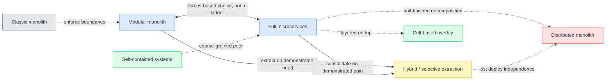
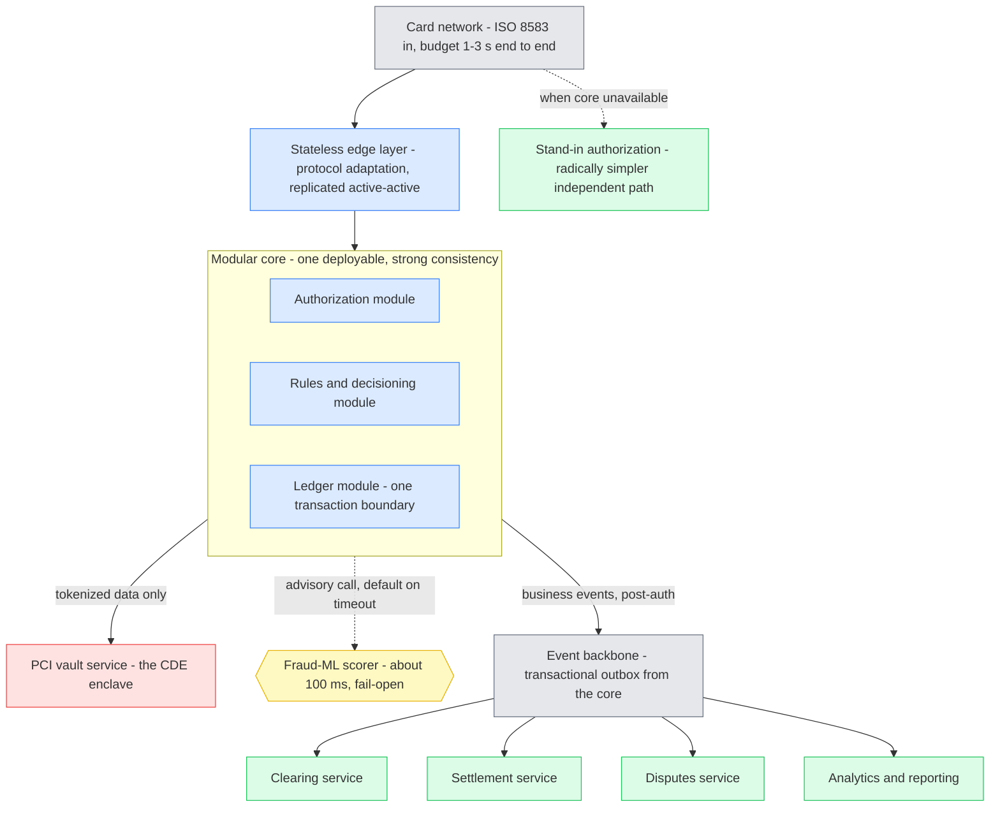
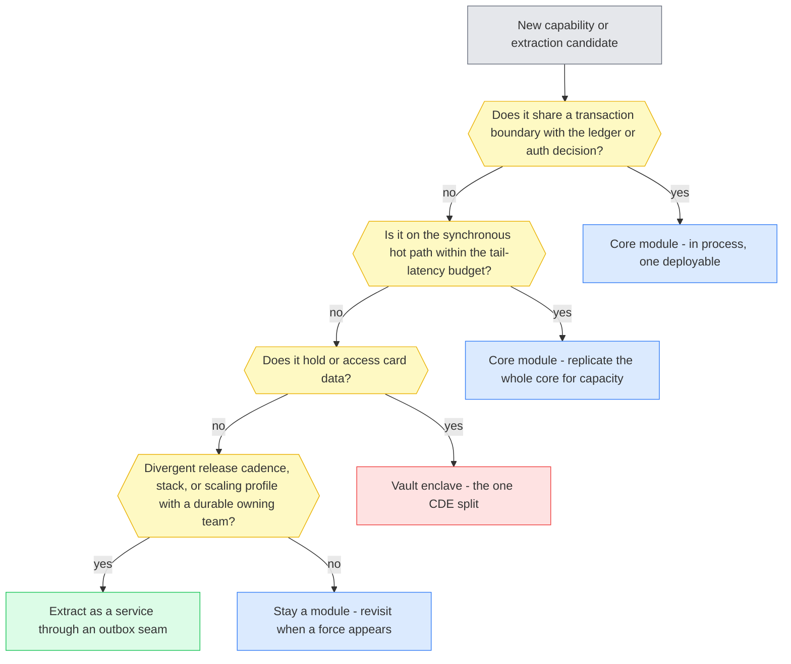

# Microservices vs Modular Monolith — Technical Design & Architecture

**Trend, popularity, and decision guidance for large-scale regulated transaction platforms.**
Architecture-enablement research deliverable. Version 1.0 — **2026-07-02**. Research window for the state-of-the-art section: **2026-05-01 → 2026-07-02**.

This document assumes the reader already knows the definitional basics of the two styles (Lewis/Fowler microservices, Spring Modulith-style moduliths — canonical references in Appendix A). It deliberately skips the generic pros/cons comparison and delivers four things that comparison articles do not: (1) the date-stamped trend and popularity evidence, (2) an adversarial audit of the statistics circulating in this debate, (3) a persona-reasoned reference architecture and decision framework for the payments/transaction-processing domain specifically, and (4) a red-teamed recommendation refreshed against the last two months of state of the art.

A condensed web version of this research is published as the site deep-dive [Microservices vs Modular Monolith — the 2026 evidence check](../src/content/deep-dives/microservices-vs-modular-monolith.md).

---

## 0. How to read this document

### Persona legend

The design reasoning in §5–§8 is written through a panel of five personas. Their stakes drive component decisions; where they conflict, the text shows how the design resolves the tension.

| Persona | Role | Stake — what they refuse to compromise |
|---|---|---|
| **Elena** | Migration / modernization architect | Every step is reversible; boundaries are proven before they become network boundaries; the migration never strands itself half-way. |
| **Rafael** | Payments domain SME | The ledger stays strongly consistent; a timeout is a decline, not a retry; ISO 8583 semantics are modeled, not abstracted away. |
| **Ingrid** | SRE / operations lead | Tail latency and blast radius are computed, not asserted; every added synchronous dependency must pay for its availability cost. |
| **Priya** | Security & compliance lead | PCI DSS scope is minimized by design; DORA-grade auditability is demonstrable, not aspirational. |
| **Marcus** | Cost & delivery owner | Platform tax is priced before it is incurred; team topology matches the architecture; no capability is built for a need that has not been demonstrated. |

### What is decided vs proposed vs open

- **Observed fact** — sourced findings from the research strands, each carrying a confidence flag and an entry in the source ledger (Appendix A).
- **Proposal** — the thesis (§4), the reference architecture (§5–§6), and the decision framework (§8). These are this document's design intent, stated before being red-teamed in §10.
- **Open** — items §11 could not close, listed explicitly. False closure is worse than an open question.

### Reading paths

- **Ten minutes:** §3 (what the trend evidence actually says) and §13 (final recommendation).
- **Architects:** everything, in order.
- **Anyone about to quote a statistic from this debate in a deck:** §3.4 first — several of the most-circulated numbers are unverifiable or misattributed.

---

## 1. Requirements

### 1.1 What this document must do (functional)

1. Establish, with dated evidence, where the microservices-vs-modular-monolith debate actually stands as of mid-2026 — separating adoption data from discourse.
2. Evaluate the "not a maturity ladder" thesis (Fritzsche, June 2026) against the evidence and against the Fowler-lineage "monolith-first" orthodoxy.
3. Translate the general debate into decision guidance for the domain this team works in: high-throughput, low-latency, regulated payment/transaction platforms undergoing legacy modernization.
4. Provide a defensible reference architecture and a forces-based decision framework, red-teamed before recommendation.

### 1.2 Non-functional targets the domain imposes

These are the domain envelope any recommended shape must survive (sources in §6–§7 and Appendix A):

- **Hot-path latency:** end-to-end authorization budgets of 1–3 s at the network edge, with individual decision components budgeted far tighter — ~100 ms for in-flow fraud scoring, 3 s (Marqeta) to 6 s (Lithic) for external decisioning callbacks.
- **Availability:** effectively five-nines on the authorization path; a missed timeout is a decline or an ISO 8583 reversal — it costs money, not just latency.
- **Consistency:** money movement and the ledger require strong consistency; eventual consistency is acceptable only post-authorization.
- **Compliance:** PCI DSS scope containment; EU DORA (in application since 2025-01-17) auditability across the estate.

### 1.3 Constraints from a representative modernization context

Carried from the architecture principles of a representative legacy-modernization program (mainframe-class transaction estate migrating to a JVM stack), which any recommendation here must not contradict:

- *Simplicity first*; *decouple by default*; **independent deployability** — "each migrated capability should support isolated build, test, and release where the target runtime allows"; *parity before optimization*; *governance as code*; *operational readiness*.
- Target stack is stateless Spring Boot services with clear request/response or event boundaries.
- The modernization context is a z/TPF-class legacy estate with dual-run/parity validation as a stated delivery mechanism.

Note the tension Elena will have to resolve in §6: *independent deployability* is a stated principle, while *parity before optimization* pulls toward like-for-like targets. The design must serve both.

---

## 2. The approach families

The design space resolves into five genuine families plus one anti-pattern. (Definitions and generic pros/cons for the first three are well covered by the canonical sources in Appendix A; this section adds the family map, maturity calls, and the layering relationships.)

| # | Family | Maturity (mid-2026) | Relationship to the others |
|---|---|---|---|
| 1 | Classic (non-modular) monolith | Production-standard, decades | Baseline; exclusive |
| 2 | Modular monolith / modulith | Production-standard since the ~2023 tooling wave (Spring Modulith GA, Packwerk) | Exclusive; deliberately keeps extraction options open |
| 3 | Full microservices | Production-standard; **no longer the default recommendation** | Exclusive |
| 4 | Hybrid / selective extraction | Production-standard (strangler fig codified in AWS/Azure guidance) | A strategy layered across families 2 and 3 — the practitioner-consensus landing zone |
| 5 | Cell-based architecture | Early-mainstream at hyperscale | **Overlay** on services, not a peer alternative |
| 5b | Self-contained systems (SCS) | Production-proven, niche (European consulting sphere) | Coarse-grained peer alternative for web estates |
| — | Distributed monolith | Anti-pattern | The failure mode families 3 and 4 degrade into |

🟦 primary families · 🟨 consensus landing zone · 🟩 niche/overlay shapes · 🟥 anti-pattern · ⬛ baseline

Three structural observations that matter for everything downstream:

1. **The double-headed arrow is the point.** The modular monolith ↔ microservices edge is deliberately drawn without a direction of progress. This is the Fritzsche correction (§3.3): the families are boundary-placement strategies selected by forces, not stages on a maturity ladder. Note that consolidation traffic flows along it in both directions — Segment and Istio walked it right-to-left.
2. **The hybrid family is a destination, not just a transition.** Strangler-fig coexistence was designed as a temporary state; the 2025–2026 practitioner consensus is that stabilizing *permanently* in a "modular core plus a few extracted satellites" shape is a legitimate — often optimal — end state. GitHub, Dropbox, and Stripe (§6.1 below) all live there on purpose.
3. **The anti-pattern is reachable from both directions.** A half-finished extraction and an over-coupled service mesh both land in the distributed monolith. Sam Newman's tell: someone's full-time job is "release coordination manager."

**Terminology discipline:** "macroservices"/"miniservices" are unstandardized labels for the granularity dial inside family 4, not a separate school — define before use. Serverless-first is a compute-granularity choice orthogonal to the module-boundary question (it recombines with either pole, from per-function services to the "Lambdalith"), and it owns its own failure mode: Thoughtworks' "Lambda pinball."

---

## 3. Trend & popularity — what the evidence actually says

This is the section the document exists for. Every item is date-stamped; confidence flags per the source ledger. The one-line synthesis: **correction, not collapse.**

### 3.1 The adoption data

| Signal | Date | Finding | Confidence |
|---|---|---|---|
| O'Reilly microservices adoption survey (n=1,502) | Jul 2020 | **77%** of respondents had adopted microservices; only 29% were building a *majority* of systems that way. Self-selected sample — treat as the hype-era high-water mark, inflated as a population estimate. | High (numbers) / Med (population) |
| JetBrains State of Developer Ecosystem | 2021–2022 | **35% → ~37%** of individual developers working on microservices — flat, not exploding. No comparable figure published 2023–2025. | High |
| O'Reilly Technology Trends | Jan 2025 | Microservices **learning-content usage −24% YoY**; DDD −22%; the report itself names modular monoliths as the idea that "may catch on." Proxy for learning interest, not production adoption. | High |
| InfoQ Architecture & Design Trends | Apr 2024 | "Designing modular monoliths" moved to **early majority** on InfoQ's adoption curve — editorially judged to have crossed the chasm. Spring Modulith's lead publicly flagged the placement. | Med-High |
| InfoQ Architecture & Design Trends | Apr 2025 | Microservices and moduliths get **no trend slot at all** — the debate has left the "trend" stage; it is settled background practice. The report is dominated by agentic AI and cell-based architecture. | High |
| DORA / State of DevOps | 2023–2024 | **Deliberately architecture-agnostic** — measures "loosely coupled architecture/teams"; their guidance notes a well-structured monolith qualifies. Neutral on this question. | High |
| Stack Overflow Developer Survey | 2024–2025 | **No architecture-style question exists.** Circulating claims derived from it are blog inference. | High |

### 3.2 The institutional signals (stronger than the surveys)

Framework investment and conference programming are harder to fake than survey self-reports:

- **Spring Modulith release train:** experimental (Oct 2022) → 1.0 GA (Aug 2023) → 1.3 (Nov 2024) → 1.4 (May 2025) → **2.0 GA (Nov 2025)** → **2.1 GA (Jun 11, 2026)**. An unbroken three-year cadence with multi-branch support is institutional commitment from the Spring team, not a hobby project.
- **.NET:** Aspire GA (May 2024) makes single-process-vs-distributed a deployment-time detail; Microsoft's own Copilot team publicly described starting as a modular monolith and splitting only when needed — monolith-first institutionalized inside Microsoft.
- **Thoughtworks Radar:** Spring Modulith blipped at **Assess** in Vol 29 (Sep 2023), with the accompanying text naming "a resurgence of interest in the well-factored monolith" and fading "microservice envy." Adversarial note: Assess is the second-lowest ring and the blip never returned for promotion — enthusiasm, not endorsement.
- **Conference arc:** QCon London 2020 "To Microservices and Back Again" (FT, Monzo, Segment) → Meta presenting **Threads shipped in five months on Instagram's monolith** (QCon, Apr 2024) → Sam Newman — the author of *Building Microservices* — at QCon London 2025: microservices "should not be the default choice." Programming moved from *how to do microservices* to *when not to*.
- **Google Trends / job postings:** no reliable primary data obtainable; the overall tech-hiring trough (US postings ~33% below pre-pandemic baseline, 2024–25) confounds any architecture signal. Reported honestly as a gap.

### 3.3 The intellectual arc, 2014 → 2026

```mermaid
flowchart LR
  a["2014 — Lewis and Fowler define microservices"]:::data
  b["2015 — Fowler: MonolithFirst and MicroservicePremium"]:::control
  c["2019-20 — Newman: decomposition without microservices; Hightower: monoliths are the future"]:::control
  d["2023 — Prime Video case goes viral; Spring Modulith GA; Radar names fading microservice envy"]:::gate
  e["2024-25 — modulith reaches early majority; Newman at QCon: not the default"]:::gate
  f["2026 — Fritzsche: neither is a stage — a forces-based choice, not a ladder"]:::human

  a --> b --> c --> d --> e --> f

  classDef control fill:#dbeafe,stroke:#3b82f6;
  classDef human fill:#dcfce7,stroke:#22c55e;
  classDef gate fill:#fef9c3,stroke:#eab308;
  classDef data fill:#e5e7eb,stroke:#6b7280;
```

The June 23, 2026 Fritzsche article ("Microservices Are Not the Next Step After a Modular Monolith") is the dialectical third beat: 2014 *"microservices!"* → 2015–2025 *"monolith first!"* → 2026 *"neither is a stage."* Its substance: the emerging modulith-first consensus quietly turns an architectural decision into a **maturity ladder**; distribution's real costs are reasons to choose services *deliberately*, not a curriculum every system must pass through; the choice should follow business capabilities, independent-deployability needs, and organizational reality (Conway), not a prescribed sequence.

**Honest weighting:** as of 2026-07-02 the article has effectively **zero measured community reception** — no Hacker News submission (verified via the Algolia API), no Lobsters or indexed Reddit thread, single-digit engagement on a paywalled page. Its *position* independently echoes in 2026 commentary rejecting the linear path, so this document adopts it as a **framing device on its merits — not as evidence of a movement**. It is also worth noting the ladder Fritzsche attacks is partly a strawman of Fowler's actual claim, which was evidential ("successful microservice systems mostly started as monoliths"), not curricular — §10 C4 takes this up.

### 3.4 The statistics audit — what not to put in a deck

Two independent research passes attempted to verify the most-circulated numbers in this debate. Results:

| Circulating claim | Verdict |
|---|---|
| "CNCF survey: **42% of microservices adopters are consolidating** into larger deployable units" | **Unverifiable — probably fabricated/AI-laundered.** Traces only to SEO blogs cross-citing each other; not present in any CNCF primary document checked (2024 survey, Jan 2026 report). Do not use without a primary source. |
| "Service-mesh adoption fell **18% → 8%**" | Same provenance problem. Unverified. |
| "Gartner: **60% of teams regret microservices**" | **Misattributed.** The real Gartner 60% figure (Jun 2023) is about technology *purchase regret generally*. Do not use. |
| "Amazon abandoned microservices" (Prime Video, 2023) | **Contested and workload-specific.** One team's video-quality-monitoring pipeline moved from Step Functions/Lambda to a single ECS process; the ~90% cost saving is self-reported; Adrian Cockcroft and others dispute the "monolith" framing. Correct citation: *serverless step-orchestration was wrong for one high-throughput stream workload.* |
| "Microservices market $7.45B, +18.8% YoY" | Vendor/SEO content, no named methodology. Do not use. |
| Gartner social-analytics: mentions of "microservices architecture" **−42%**, Jan 2019 → Sep 2020 | The one usable Gartner datum, and it is about *discourse volume*, not adoption. Medium confidence. Note the coincidence of two different "42%" claims in this space — a reason for suspicion, not confidence. |

And the reversal case studies, correctly weighted: **Segment** (2018–2020, 100+ services → one, real and well-documented) and **Istio istiod** (Mar 2020 — the service-mesh project consolidating its own five control-plane services into one binary because one team operated them all) are the strong precedents. The much-advertised 2024–2026 wave of "we killed 47 microservices" posts is **almost entirely anonymous SEO content; no named-company reversal at Segment/Prime-Video scale surfaced for 2024–2026.** The discourse outran the evidence. An academic anchor exists — the multivocal literature review "From Microservice to Monolith" (MDPI Electronics, Apr 2024) — cataloging motives: cost, complexity, team size.

### 3.5 Synthesis

Microservices adoption plateaued at high levels and is not collapsing; *learning interest* is measurably declining; the modular monolith moved from contrarian quote (Hightower, Jan 2020) → analyst hedge (Radar Assess, Sep 2023) → first-class supported frameworks (Spring Modulith 1.0→2.1; Aspire) → "early majority" (InfoQ, Apr 2024) → default conference wisdom (Newman, 2025). The strongest evidence for the modular-monolith side is **institutional** (framework investment, Shopify/Meta at scale, Microsoft's own guidance) — not the viral statistics, most of which fail verification. The debate itself has left the trend stage: by 2025 the architecture press had moved on, treating "right-size your boundaries" as settled practice.

---

## 4. Recommended thesis (pre-critique)

Stated plainly, then attacked in §10:

> **T1 — Adopt the forces frame, not the ladder frame.** The modular monolith and microservices are boundary-placement strategies selected by present forces (team topology, deploy-independence needs, scaling asymmetry, consistency requirements, compliance boundaries, operational maturity) — not sequential stages. A team whose forces clearly indicate services may start with services; a team whose forces indicate a single deployable is not "behind."
>
> **T2 — For this domain, the forces have a known resolution.** For a high-throughput, strongly consistent, regulated transaction platform, the evidence-weighted shape is: a **strongly consistent modular core** (authorization decisioning + ledger) deployed as one unit, stateless and replicated active-active on the hot path; **exactly two default extractions** — the PCI card-data vault and the fraud/risk-ML scorer — each justified by a force (compliance scope; release-cadence and stack divergence); and an **event backbone carrying everything post-authorization** (clearing, settlement, disputes, notifications, analytics) as independently deployable services where eventual consistency is natively acceptable. Further extractions happen only on demonstrated need, through seams the modular core makes cheap.
>
> **T3 — For legacy modernization specifically, parity dominates.** A like-for-like modular target is dual-run/parity-checkable; a decomposed async target is not (message ordering and eventual consistency make output diffing ambiguous). Modernize to the modular core first, decompose later through proven seams — not because of a maturity ladder, but because the *parity force* is present and decisive during migration.

The generalized principle behind T2: spend the distribution budget only where the forces actually live. Distribution is the expensive resource here, exactly as reasoning tokens are in an AI system — the easy majority of the platform (post-auth, advisory, read-mostly paths) can afford it; the hard core (money movement, tail-latency-bound decisioning) cannot.

---

## 5. High-level reference architecture

🟦 modular core & hot path · 🟥 compliance enclave · 🟨 advisory decision gate · 🟩 post-auth services & resilience path · ⬛ transport & events

**Walkthrough.** An authorization enters through a stateless, protocol-adapting edge (Adyen's "PAL" shape) and lands in the modular core, where the authorization, rules, and ledger modules execute **in process** — no network hop between the decision and the money. Card data is tokenized at the edge; only the vault service ever holds PANs, and it is the sole component inside the PCI CDE. Fraud scoring is called synchronously but *advisorily*: a strict budget (~100 ms), a default decision on timeout, fail-open semantics — its unavailability degrades precision, never availability. Everything after the authorization decision leaves the core exactly once, through a transactional outbox onto the event backbone, and is consumed by independently deployable post-auth services where eventual consistency is the domain's native semantics anyway. A separate, radically simpler stand-in path (Monzo's pattern) can authorize alone when the core or its infrastructure is down.

**Trust boundaries.** Untrusted input exists at two places: the network edge (malformed/hostile ISO 8583 — contained by the protocol adapter, which is part of why the edge is a separate stateless layer) and the CDE boundary (only tokens cross it outward; nothing but the vault de-tokenizes).

This is the shape practitioners actually converge on — it is neither pole of the generic debate. Adyen runs the modular-core-plus-stateless-edge half at top-10-PSP scale; Lithic runs the active-active replicated hot path; Stripe runs the boundary-idempotency and in-process fraud-feature-cache discipline; Monzo — at the opposite architectural pole — still built the simple independent stand-in, which is itself evidence for the thesis.

---

## 6. Component deep-dive (through the personas)

### 6.1 The modular core — authorization, rules, ledger

**Rafael (domain SME)** sets the load-bearing constraint: authorization and ledger posting are one business fact. Sagas explicitly cannot give atomicity, and the practitioner consensus carves out double-entry bookkeeping as the case where you design for co-location — same database, same service — rather than compensate across services. Splitting the ledger is where microservice migrations in this domain actually fail. So the core is one deployable with one transaction boundary.

**Ingrid (SRE)** supplies the second argument, and it is arithmetic, not taste: with a ~250 ms internal budget, the hop tax is not the *mean* latency of a hop but the *tail*. Five to eight sequential service hops, each contributing p99 jitter (GC pauses, connection churn, sidecar proxies), blow the tail budget even when every mean looks fine. And each synchronous dependency is an availability multiplicand: at 99.99% per dependency, five in sequence yields 99.95% — you have spent half an order of magnitude of availability on topology. Her conclusion: on the hot path, availability comes from **replication of a simple thing** (active-active stateless instances), not decomposition into many things. Stripe Radar's engineering makes the same point from the latency side — of its ~100 ms budget, model inference costs 1–2 ms and *feature fetches at 2–5 ms per network round trip eat the rest*, which is why the winning move was in-process caching, not more services.

**Elena (migration architect)** adds the modernization-specific force: the core must be **dual-run parity-checkable** against the legacy system. Deterministic, comparable per-transaction outputs are feasible for a like-for-like modular target and ambiguous for a decomposed async target (Google's Dual Run — from Santander's Gravity — reconciles every transaction across both systems before cutover; that requires output comparability). This resolves the §1.3 tension in favor of *parity before optimization* during migration, with *independent deployability* satisfied at module granularity — isolated build and test per module, enforced by Spring Modulith module verification and `@ModuleSlicing` tests (2.1, Jun 2026) — and at service granularity only after cutover, through the outbox seams.

**Marcus (cost owner)** notes what the core avoids paying: Monzo's ~2,800-service estate works because of extreme homogeneity plus a funded central platform organization doing mass migrations, bespoke deploy tooling, and per-service network policy — a bill most enterprises will not fund. He also names the monolith's own bill honestly: past several hundred engineers on one codebase, the CI investment is Stripe-grade (selective test execution over a 50M-line monorepo) — the tooling tax is real on both sides, it just buys different things.

### 6.2 The stateless edge

**Ingrid** requires the edge to be dumb, stateless, and horizontally replicated — it is the availability workhorse and the deploy-canary surface. **Priya (security)** requires tokenization to happen *here*, so card data never enters the core: the core stays out of the CDE. **Rafael** requires the protocol adapter to own ISO 8583 semantics — including the reversal (0400) flow on timeout — so timeout behavior is a modeled domain outcome, not an infrastructure accident.

### 6.3 The PCI vault — the first default extraction

**Priya** owns this one. PCI scope follows **access and exposure, not service boundaries**: any component that can reach de-tokenization, or that logs PANs, drags itself into scope. Keeping card data inside the monolith puts the whole monolith in the CDE; splitting into many services *inside* the CDE means N sets of audit evidence. The winning shape is **one deliberate split** — a small vault enclave, tokens everywhere else. This is exactly the exception Shopify carved out of its otherwise-monolithic estate, and it is why the vault is a *default* extraction in T2 rather than a case-by-case call. **Marcus** concurs for a different reason: the vault's release cadence is glacial, its blast radius catastrophic — the profile that justifies deployment independence.

### 6.4 The fraud/risk-ML scorer — the second default extraction

The natural seam, observed everywhere: Stripe Radar is a distinct ML system inside the auth flow; Adyen — otherwise deliberately monolithic — built a separate fraud engine; Visa runs Advanced Authorization as a network-layer scoring service. **Why the seam is clean** (Rafael + Marcus): the call is *advisory* (fail-open with a default decision — it can never take availability down), read-mostly, on an independent release cadence (model retrains), typically a different stack (Python, feature stores), with a crisp request/response contract. It is the textbook "yes, extract this" even inside a modular-monolith strategy. **Ingrid** adds the budget discipline: a hard ~100 ms deadline enforced by the caller, with the default decision pre-computed.

### 6.5 The event backbone and post-auth services

**Elena** frames the rule: events leave the core through a **transactional outbox** (solving the dual-write problem; now first-class in Spring Modulith's event externalization, with new outbox integrations in 2.1), and everything post-authorization is where distribution is *cheap* — clearing, settlement, disputes, notifications, analytics natively tolerate eventual consistency and have genuinely different load profiles (batch vs spiky) and release cadences. This is where the team's *independent deployability* principle gets its full expression, at near-zero consistency cost. **Priya** notes the backbone also carries the audit trail: business events as immutable facts are the DORA-friendly evidence surface.

### 6.6 Stand-in authorization

The design's humility component, and deliberately **not** part of the core. **Ingrid**: when the core, its datastore, or its entire cloud region is down, a radically simpler independent path — minimal rules, conservative limits, separate infrastructure — keeps cards working. Monzo (maximal-microservices pole) built exactly this on a *different cloud*; the legacy world calls it stand-in processing and has run it for decades. The persona conflict here is instructive: **Marcus** initially objects to funding a second authorization system; **Rafael** overrules — in this domain a declined card at a point of sale is the single most customer-visible failure mode that exists, and the network's own stand-in facilities set the precedent. Resolution: the stand-in is small enough that its cost is an insurance premium, and its radical simplicity is a *feature* (it must not share failure modes with the core).

---

## 7. Data, security & governance

**Data ownership.** One physical database for the core with module-owned schemas and no uncontrolled cross-module queries; database-per-service for the post-auth services; a dedicated idempotency store at the boundary (Adyen pairs strongly consistent Postgres accounting with a CockroachDB idempotency store; Stripe enforces idempotency keys at the API contract). Idempotency is an API-contract problem solved at the boundary — not a topology problem solved by service count.

**Consistency map.** Strong consistency inside the core's single transaction boundary (authorization + ledger). Exactly-once *effect* at the boundary via idempotency keys. Eventual consistency on the backbone and beyond, where the domain natively reconciles (clearing and settlement are reconciliation processes by definition).

**PCI DSS.** As §6.3: one CDE enclave, tokenization at the edge, scope follows access. The PCI SSC issued a dedicated scoping-and-segmentation supplement for modern architectures precisely because dynamic service meshes make segmentation evidence hard — a mesh inside the CDE grows the audit. Claims of "up to 90% scope reduction" from tokenization vendors are self-reported; the *direction* is well supported, the magnitude is marketing.

**DORA (EU 2022/2554, in application since Jan 2025).** Demonstrable ICT risk management, incident reporting, resilience testing, and end-to-end traceability, including third-party providers. The architecture consequence: every extracted service multiplies the evidence surface (per-service change logs, dependency maps, provider exit strategies) and turns transaction traceability from a database query into a distributed-tracing engineering project. Monzo's telemetry estate is what making a mesh auditable costs. The modular core's audit story is structurally simpler — a genuine compliance argument *for* consolidation that generic comparisons miss.

**Untrusted input.** Hostile ISO 8583 is contained at the protocol adapter; the core never parses raw wire input. Nothing but the vault de-tokenizes.

---

## 8. Design patterns & the decision framework

Generic side-by-side topology diagrams and scoring guides exist in every comparison article. This section adds what they lack: the forces-based decision tree that replaces the ladder, and the honest comparison of the three *composable* strategies on the dimensions this domain cares about.

### 8.1 The forces-based decision tree

Notice what is absent: there is no "are we mature enough yet?" gate. Maturity appears only as a *cost multiplier* on the "extract" branch (Marcus prices it), never as a rite of passage — that is the ladder frame this document rejects. Fritzsche's point, operationalized: every gate is a present force, not a stage.

### 8.2 Strategy comparison for this domain

| Dimension | Modular monolith (everything) | Full microservices (everything) | **Composite (T2): modular core + seams** |
|---|---|---|---|
| Hot-path tail latency | Best — in-process calls | Worst — sequential hops compound p99 | Core in-process; only advisory calls cross the network |
| Ledger consistency | Native | Sagas — explicitly non-atomic | Native inside the core |
| Availability math | One unit, replicate it all | Each sync dependency multiplies risk | Replicated simple core; async everywhere else |
| PCI scope | Whole system in CDE (fails) | N services of audit evidence in CDE | One enclave (best case) |
| DORA auditability | Simple story | Distributed-tracing project | Simple core; event trail for the rest |
| Independent deploy of post-auth domains | No — shared release train | Yes | Yes — where it is cheap |
| Selective scaling (auth vs batch) | No — clone everything | Yes | Yes — core scales as one, services scale alone |
| Dual-run parity during migration | Best — deterministic outputs | Ambiguous — async ordering | Core is parity-checkable; backbone cut over after |
| Platform/tooling bill | CI at scale (Stripe-grade past ~100s of engineers) | Monzo-grade platform org | Moderate — one core pipeline + per-service pipelines where they pay |
| Failure mode if discipline slips | Erodes into tangled monolith | Erodes into distributed monolith | Either — needs both disciplines (honest cost) |

The generic verdict — *the right answer is a composition, not a single winner* — sharpens in this domain into a specific composition, because the forces are unusually legible: consistency and tail latency pin the core together; compliance and ML cadence pin the two extractions apart; post-auth semantics make distribution free.

---

## 9. Fit to a modernization program

How the recommendation lands in a typical strangler-façade modernization program of this class:

- A phased **migration roadmap** (strangler façade → extraction) is consistent with T2/T3 *if* extraction targets are chosen by the §8.1 gates rather than by a component-count cadence. Per-component readiness scorecards, if the program keeps them, are effectively force-detectors already — they can carry the §8.1 gates as explicit fields.
- The **architecture principle "independent deployability"** is satisfied at two granularities: module-level (isolated build/test/release verification inside the core — Spring Modulith is the enforcement tooling, and it is on the team's target stack) and service-level post-auth. The principle does not require the ledger to cross a network to be independently *testable*.
- A **parity-harness contract** (dual-run comparability as a stated delivery mechanism) is the T3 argument institutionalized: it weights the like-for-like modular target for the core during migration.
- The widely-cited **Stripe lesson** ("unified codebase with domain boundaries over forced fragmentation") is corroborated by this document's domain evidence, with Adyen now the stronger proof case to cite — first-party, payments-native, and current.

---

## 10. Design critique — red-teaming our own approach

Numbered, specific, adversarial. §11 attempts to close each.

- **C1 — Survivorship and incumbency bias in the proof cases.** Adyen, Stripe, Shopify *kept* monoliths they already had; z/TPF cores are incumbencies. No published case shows a modular monolith being *newly chosen* for a card-network-scale switch post-2020. The evidence may show that keeping a good monolith works — not that building one is the right green-field or re-platform choice.
- **C2 — The trend evidence measures discourse, not production.** O'Reilly counts learning-content views; InfoQ curves are editorial judgment; Radar is consultancy opinion; the conference arc is programming committees. Real production adoption 2023–2026 is essentially unmeasured (JetBrains dropped the question; CNCF numbers are unverifiable). The "correction, not collapse" narrative could itself be a discourse artifact.
- **C3 — T2 may under-serve organizational scaling.** The composite gives the core a shared release train. If the modernized platform ends up with 300+ engineers on the core, the coordination cost could recreate exactly the delivery drag that pushed the industry to services — and the doc's answer ("Stripe-grade CI") is an expensive, specialized bet of its own.
- **C4 — The Fritzsche framing is doing a lot of work for an article nobody has engaged with.** Zero measured reception; paywalled; and its "maturity ladder" target is partly a strawman — Fowler's monolith-first claim was evidential, not curricular. Building the document's headline frame (T1) on it risks anchoring internal guidance to one practitioner's unreviewed essay.
- **C5 — The hop-tax argument assumes synchronous chains.** A competent microservices design for the hot path would use few hops, async pre-computation, request hedging (Lithic does exactly this *with services*), and co-located data. Lithic's active-active service-oriented auth platform at 99.99%+ is a live counterexample to "the hot path must be one process."
- **C6 — The AI-agent factor could invert the calculus.** If LLM agents make service scaffolding, cross-repo navigation, and per-service refactoring nearly free (the ben.page argument), the marginal cost of distribution — the core of every anti-microservices argument in this document — drops. T2's cost model could be stale within 1–2 years.
- **C7 — T3 risks a parity trap.** "Modernize like-for-like, decompose later" can strand the program at "later": the parity-validated modular core ships, the pressure is off, and the promised seams never get exercised — leaving a modernized monolith with all the §8.2 right-column costs and none of the extraction benefits. The strangler literature's "coexist" state has a known failure mode: permanence by inertia. (Note this cuts opposite to C1: C1 doubts the monolith endpoint, C7 doubts ever leaving it.)
- **C8 — The PCI argument assumes a tokenization program exists.** "One vault enclave" presupposes edge tokenization is built and certified. During migration from a legacy estate where PANs flow through the core, the interim state may put the *modular core itself* in scope — making the CDE argument aspirational for exactly the period the doc is meant to guide.

---

## 11. Concluding research — closing the gaps

Each critique, resolved or explicitly left open, from the evidence already gathered plus targeted re-checks:

- **C1 — partially resolved, direction unchanged.** Two mitigations: (a) Meta's Threads (Apr 2024) *is* a recent consequential green-field-ish choice — a new product deliberately built on a monolithic substrate for speed at extreme scale; (b) for the modernization case specifically, the choice is never green-field — the incumbency evidence is exactly on point, and IBM's own z/TPF guidance (hybrid: keep the deterministic-latency core, expose APIs, move surrounding logic out) matches T2's shape. **Remains open for true green-field builds:** the honest statement is that green-field preference remains under-evidenced either way; the §8.1 gates, not the proof cases, are the load-bearing guidance there.
- **C2 — acknowledged and absorbed into the doc's claims.** The document's headline conclusions are deliberately phrased as claims about *the debate and its defaults* (which the discourse evidence does measure) plus *domain physics* (latency, consistency, compliance — which do not depend on adoption statistics at all). Where production adoption is asserted, it rests on first-party engineering sources (Adyen, Monzo, Stripe, Shopify, Lithic), not surveys. **Unresolved and stated:** nobody currently measures production architecture-style adoption credibly. Treat any future stat with §3.4-grade suspicion.
- **C3 — resolved by an explicit tripwire.** The composite is not "never split the core": the §8.1 tree's fourth gate (durable owning team + divergent cadence) exists precisely for the day core-team coordination cost becomes the dominant force. Operationalize it: if release-train coordination (Newman's "release coordination manager" tell) appears, that *is* the force, and rules/limits-management — typically the highest-churn module in this domain (rule changes ship weekly by the hundreds at card-network scale) — is the pre-identified next seam. The answer to C3 is not a bigger core; it is that the framework already contains its own exit.
- **C4 — resolved by demotion.** T1 does not rest on Fritzsche; it rests on the forces analysis in §6–§8, which stands on its own evidence. The article is retained as the *articulation* of the frame (and credited as the prompt for this research), cited with its reception honestly stated. Where the doc previously might have said "the community now agrees," it says nothing of the sort — §3.3 explicitly warns against citing it as a movement.
- **C5 — conceded in part; the thesis narrows, correctly.** Lithic proves a service-oriented hot path is *viable* with active-active replication, hedging, and few hops. The claim that survives is narrower and stronger: the *ledger transaction boundary* must not be distributed (sagas are non-atomic — this is not contested anywhere credible), and every hot-path hop must be paid for from the tail budget. Whether the auth *decisioning* around the ledger is one process (Adyen) or three coarse replicated services (Lithic) is a legitimate forces call — both are compatible with T2's principle (few boundaries, deliberate, replicated); neither resembles a fine-grained mesh. The reference architecture's core is the *default*, not a dogma.
- **C6 — open, monitored, two-sided.** The May–June 2026 essays argue both directions (agents reason better in one well-modularized repo vs agents make service proliferation safe and cheap) with zero empirical studies either way. Two stabilizing observations: (a) both camps agree *enforced boundaries* are what helps agents — Spring Modulith verification/Packwerk/ArchUnit pay off in either topology; (b) the domain forces in §6 (consistency, tail latency, PCI, DORA) are unaffected by agent economics. **Revisit trigger:** any empirical study of agent productivity vs architecture, or agent-authored-service incident data. Until then, agent-friendliness is a real but unquantified tiebreaker, not a decider.
- **C7 — resolved by governance, honestly priced.** The anti-inertia mechanism must be structural, not aspirational: (a) the two default extractions (vault, fraud-ML) are scheduled *during* migration, not after — they exercise the seams while the program still has funding and attention; (b) the outbox/event externalization is built into the core from day one (cheap now, in Spring Modulith; expensive to retrofit); (c) each readiness scorecard carries a "next-seam candidate: yes/no + force" field so extraction candidacy is reviewed per wave, not deferred globally. If after that the seams stay unused, T1 says that is a *finding, not a failure* — the forces never materialized.
- **C8 — conceded; sequencing amended.** Edge tokenization + vault is re-ordered to be the **first extraction wave, before core migration** — it shrinks the CDE for the *legacy* estate too, de-risks the dual-run (parity comparisons run on tokenized data, keeping the harness out of scope), and is independently valuable even if the broader program stalls. The interim-state scope cost was real; the fix is sequencing, and the doc now says so.

---

## 12. What we missed — last-two-months SOTA refresh (2026-05-01 → 2026-07-02)

Date-stamped deltas against the drafted design, not a news roundup:

- **Spring Modulith 2.1 GA (Jun 11, 2026)** — directly strengthens two design choices: `@ModuleSlicing` makes "test a module like a service" concrete (the §9 module-granularity answer to *independent deployability* is now tooling-backed, not aspirational), and new outbox integrations (Namastack, JobRunr externalization) confirm the event-externalization seam is where the framework itself is investing. **Confirms §6.5; no change needed.**
- **Spring Boot 4.1 with first-class gRPC (Jun 2026)** — lowers friction for the composite's "few coarse extracted services" calls (fraud scorer contract). Minor positive; note Spring Boot 3 EOL Jun 30, 2026 as a migration-planning fact.
- **Aspire 13.3 (May 7, 2026)** — the .NET ecosystem keeps converging on "single-process vs distributed is a deployment-time detail." Cross-stack confirmation of the forces frame.
- **Istio ambient/KubeCon EU direction (Mar–Apr 2026, pre-window context)** — sidecar-less mesh keeps lowering the per-service operational tax. Honest implication: one classic anti-microservices cost argument is *weakening over time*; the §6 arguments deliberately rest on latency/consistency/compliance physics rather than mesh overhead, and this is why.
- **The AI-agent discourse (May–Jun 2026)** — the genuinely new ingredient; absorbed as C6. One design got *sharpened* by it: the doc now explicitly notes enforced module boundaries help agents in either topology.
- **What the window did not contain:** no watershed release, no major named reversal case, no community engagement with the Fritzsche article, and DDD Europe 2026 (Jun 10–12, Antwerp) talk content not yet published — **re-sweep in ~4–6 weeks** for sizing-relevant material.
- **The one thing the draft got wrong** before this pass: an earlier framing treated the "42% consolidation" figure as merely "low confidence." Two independent verification attempts later, it is upgraded to "probably fabricated" and moved into the §3.4 do-not-use table. The broader lesson is now a document feature: this debate's statistics are polluted by SEO/AI-generated content cross-citing itself; primary-source discipline is not optional here.

---

## 13. Final recommendation & honest scope

### 13.1 The recommendation

Adopt the **forces frame** (T1): retire "monolith → modulith → microservices" ladder language from internal guidance and decks, and replace it with the §8.1 gates. For regulated transaction platforms, default to the **composite shape** (T2): a strongly consistent, dual-run-parity-checkable modular core (auth + ledger) replicated active-active; vault and fraud-ML as the two default extractions — vault **first**, before core migration (C8); an outboxed event backbone making everything post-authorization independently deployable; a radically simple stand-in path. Extract further only when a §8.1 force materializes, through seams built into the core from day one (C7). On the trend question that prompted this research: report the state of the field as **"correction, not collapse — and the debate is over as a trend"**, cite the institutional signals (§3.2) and first-party engineering cases, and treat every viral statistic in this space as guilty until primary-sourced (§3.4).

### 13.2 Honest scope

What this document is *not* evidence for: green-field architecture preference outside this domain (C1, open); production adoption rates (C2, unmeasured by anyone); the AI-agent effect on distribution economics (C6, open, revisit on evidence); and any claim that the modular core is forever — the framework contains its own exit (C3), and using it is a finding, not a failure. The two-month SOTA window was quiet; the DDD Europe 2026 output and any empirical agent-vs-architecture study are the named re-sweep triggers. The canonical sources in Appendix A remain the definitional reference; this document is the evidence layer and the domain-specific decision framework on top of them.

---

## Appendix A — Source ledger

Confidence: **H** = primary/first-party or independently corroborated · **M** = single credible source or secondary echo · **L** = contested, vendor-only, or unverifiable. Claims marked ✗ failed verification and must not be reused.

| # | Claim (short) | Source | Conf. | Notes |
|---|---|---|---|---|
| 1 | 77% microservices adoption (2020) | [O'Reilly survey, Jul 2020](https://www.oreilly.com/radar/microservices-adoption-in-2020/) | H/M | Self-selected sample; high for the number, medium as population estimate |
| 2 | Microservices learning content −24% YoY | [O'Reilly Tech Trends, Jan 2025](https://www.oreilly.com/radar/technology-trends-for-2025/) | H | First-party platform data; proxy for interest, not adoption |
| 3 | Modular monolith at "early majority" | [InfoQ Trends, Apr 2024](https://www.infoq.com/articles/architecture-trends-2024/) | M-H | Editorial adoption curve; placement echoed by Spring Modulith lead |
| 4 | Micro-vs-mono absent from 2025 trends report | [InfoQ Trends, Apr 2025](https://www.infoq.com/articles/architecture-trends-2025/) | H | Absence verified by direct fetch |
| 5 | JetBrains: 35–37% of devs on microservices, 2021–22; no data since | [JetBrains DevEco 2021](https://www.jetbrains.com/lp/devecosystem-2021/microservices/), [2022](https://www.jetbrains.com/lp/devecosystem-2022/microservices/) | H | Question apparently dropped in later editions |
| 6 | DORA is architecture-style-agnostic | [dora.dev capability pages](https://dora.dev/capabilities/loosely-coupled-teams/) | H | Well-structured monolith explicitly qualifies |
| 7 | "CNCF: 42% consolidating microservices" | SEO blogs only (byteiota, SoftwareSeni et al.) | ✗ | Not in any CNCF primary doc; two independent verification attempts failed |
| 8 | "Gartner: 60% regret microservices" | Misattribution of [Gartner Jun 2023 purchase-regret PR](https://www.gartner.com/en/newsroom/press-releases/2023-06-14-gartner-survey-reveals-60-percent-of-technology-buyers-involved-in-renewal-decisions-regret-nearly-every-purchase-they-make) | ✗ | Real stat is about tech purchases generally |
| 9 | Gartner: microservices mentions −42% (Jan 2019→Sep 2020) | [Gartner](https://www.gartner.com/smarterwithgartner/should-your-team-be-using-microservice-architectures) | M | Social-analytics discourse volume, not adoption |
| 10 | Prime Video: −90% cost, workload-specific, "monolith" label disputed | [devclass, May 2023](https://devclass.com/2023/05/05/reduce-costs-by-90-by-moving-from-microservices-to-monolith-amazon-internal-case-study-raises-eyebrows/); [The New Stack rebuttal](https://thenewstack.io/amazon-prime-videos-microservices-move-doesnt-lead-to-a-monolith-after-all/) | H (event) / L (framing) | Self-reported figure; one team's VQA pipeline |
| 11 | Segment: 100+ services → 1 | [Twilio/Segment blog](https://www.twilio.com/en-us/blog/developers/best-practices/goodbye-microservices); [InfoQ QCon 2020](https://www.infoq.com/news/2020/04/microservices-back-again/) | H | The strong named reversal precedent |
| 12 | Istio consolidated its own control plane (istiod) | [Istio blog, Mar 2020](https://istio.io/latest/blog/2020/istiod/) | H | First-party |
| 13 | Threads shipped in 5 months on Instagram's monolith | [InfoQ, Apr 2024](https://www.infoq.com/modular-monolith/news/) | H | QCon London talk coverage |
| 14 | No named large-company reversal 2024–2026 | Negative finding, two research passes | M-H | 2025–26 "reversal wave" content is anonymous SEO material |
| 15 | Spring Modulith cadence: 1.0 GA Aug 2023 → 2.0 GA Nov 2025 → 2.1 GA Jun 11 2026 | [spring.io release posts](https://spring.io/blog/2026/06/11/spring-modulith-2-1-ga-2-0-7-and-1-4-12-released) | H | First-party; download counts not publicly available |
| 16 | Thoughtworks Radar: Spring Modulith at Assess, Vol 29 only | [Radar blip](https://www.thoughtworks.com/radar/languages-and-frameworks/spring-modulith) | H | Never promoted to Trial/Adopt — enthusiasm, not endorsement |
| 17 | Newman at QCon 2025: microservices "should not be the default" | QCon London 2025 recaps | M | Secondary summaries; exact wording unverified |
| 18 | Fritzsche article content & thesis | [Level Up Coding, Jun 23 2026](https://levelup.gitconnected.com/microservices-are-not-the-next-step-after-a-modular-monolith-01287f0fde4e) | H | Fetched directly |
| 19 | Fritzsche article: zero community reception as of Jul 2 2026 | HN Algolia API (0 hits), Lobsters search, web search | H (HN/Lobsters) / M (Reddit) | Reddit fetch blocked; nothing surfaced via search |
| 20 | Adyen: single Java+Postgres platform, no public cloud, stateless edge | [Adyen "Design to Duty"](https://www.adyen.com/knowledge-hub/design-to-duty-adyen-architecture) | H | First-party, 2021–22 vintage — the modular-monolith-at-scale proof case |
| 21 | Monzo: ~2,800 Go microservices + central-team migration cost | [Monzo blog, Aug 2024](https://monzo.com/blog/how-we-run-migrations-across-2800-microservices) | H | First-party; platform-org cost qualitative only |
| 22 | Monzo Stand-in: separate simple auth stack on another cloud | [Monzo blog](https://monzo.com/blog/tolerating-full-cloud-outages-with-monzo-stand-in) | H | First-party |
| 23 | Stripe: 50M-line Ruby monorepo, selective test execution | [Stripe dev blog](https://stripe.dev/blog/selective-test-execution-at-stripe-fast-ci-for-a-50m-line-ruby-monorepo) | H | First-party; "Stripe is now microservices" framings are third-party inference (L) |
| 24 | Stripe Radar: ~100 ms budget, 1–2 ms inference, network feature fetches dominate | [Stripe Radar ML guide](https://stripe.com/guides/primer-on-machine-learning-for-fraud-protection); [ByteByteGo analysis](https://blog.bytebytego.com/p/how-stripe-detects-fraudulent-transactions) | H/M | First-party guide + secondary breakdown |
| 25 | Lithic: active-active service-oriented critical auth path, hedging | [Lithic engineering, Jan 2025](https://www.lithic.com/blog/card-authorization-platform) | H | First-party; availability self-reported |
| 26 | Marqeta 3 s / Lithic 6 s decision deadlines | [Marqeta docs](https://www.marqeta.com/docs/developer-guides/managing-timeouts); [Lithic docs](https://docs.lithic.com/docs/auth-stream-access-asa) | H | First-party documentation |
| 27 | Sagas cannot give atomicity; co-locate the ledger | [AWS saga guidance](https://docs.aws.amazon.com/prescriptive-guidance/latest/cloud-design-patterns/saga-choreography.html); [Temporal](https://temporal.io/blog/mastering-saga-patterns-for-distributed-transactions-in-microservices); practitioner consensus | H | Uncontested across sources |
| 28 | PCI scope follows access/exposure; one-enclave pattern; mesh-in-CDE grows audit | [PCI SSC scoping supplement](https://blog.pcisecuritystandards.org/new-information-supplement-pci-dss-scoping-and-segmentation-guidance-for-modern-network-architectures); [GCP guidance](https://cloud.google.com/architecture/limiting-compliance-scope-pci-environments-google-cloud) | H | "90% scope reduction" figures are vendor self-reported (L) |
| 29 | Google Dual Run: per-transaction dual-run reconciliation for mainframe migration | [Google Cloud](https://cloud.google.com/blog/products/infrastructure-modernization/dual-run-by-google-cloud-helps-mitigate-mainframe-migration-risks) | H | From Santander's Gravity; parity requires output comparability (inference, flagged) |
| 30 | IBM z/TPF guidance: hybrid modernization, keep the core | [IBM Redpaper REDP-5714](https://www.redbooks.ibm.com/abstracts/redp5714.html) | H | No public case of a z/TPF-class switch replaced by microservices — stated gap |
| 31 | Shopify: Packwerk-enforced modular monolith; vault extracted for PCI | [Shopify engineering](https://shopify.engineering/deconstructing-monolith-designing-software-maximizes-developer-productivity); [Packwerk retrospective](https://shopify.engineering/a-packwerk-retrospective) | H | First-party, incl. honest retrospective |
| 32 | AI-agent architecture debate is two-sided, no empirical studies | [ben.page, Apr 2026](https://ben.page/microservices) + [HN thread](https://news.ycombinator.com/item?id=43592567); Medium essays May 2026 | M | Emerging argument, thin evidence — tiebreaker, not decider |
| 33 | Visa/Mastercard switch internals | — | ✗/gap | No verifiable public architecture documentation exists; marketing only |
| 34 | Aspire GA May 2024; 13.3 May 2026; MS Copilot team monolith-first | [Aspire GA](https://devblogs.microsoft.com/dotnet/dotnet-aspire-general-availability/); [13.3](https://devblogs.microsoft.com/aspire/whats-new-aspire-13-3/); [Copilot team blog](https://developer.microsoft.com/blog/how-the-copilot-team-leverages-dotnet-aspire) | H | "Aspire = modulith enabler" is community framing (M) |
| 35 | Multivocal literature review of reversals | [MDPI Electronics, Apr 2024](https://www.mdpi.com/2079-9292/13/8/1452) | M | Academic anchor for reversal motives: cost, complexity, team size |

**Excluded from this document entirely** (adversarial-evidence checklist): the "42% consolidation" and "18%→8% service mesh" statistics (#7), the misattributed Gartner regret figure (#8), microservices market-size claims, "architecture as a toggle switch" AI hype, anonymous 2025–26 reversal listicles, and all vendor-self-reported accuracy/scope-reduction magnitudes beyond directional use.
